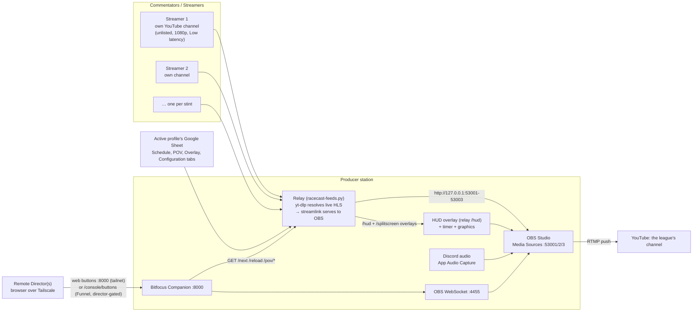
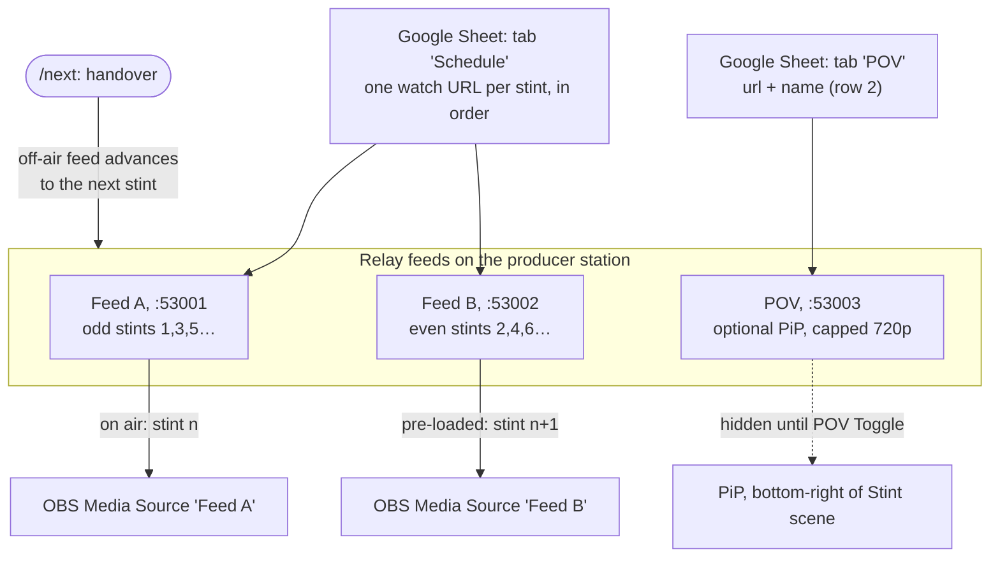
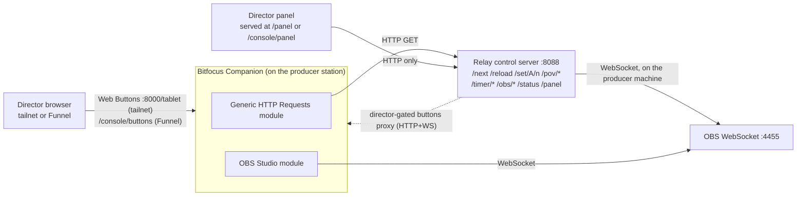
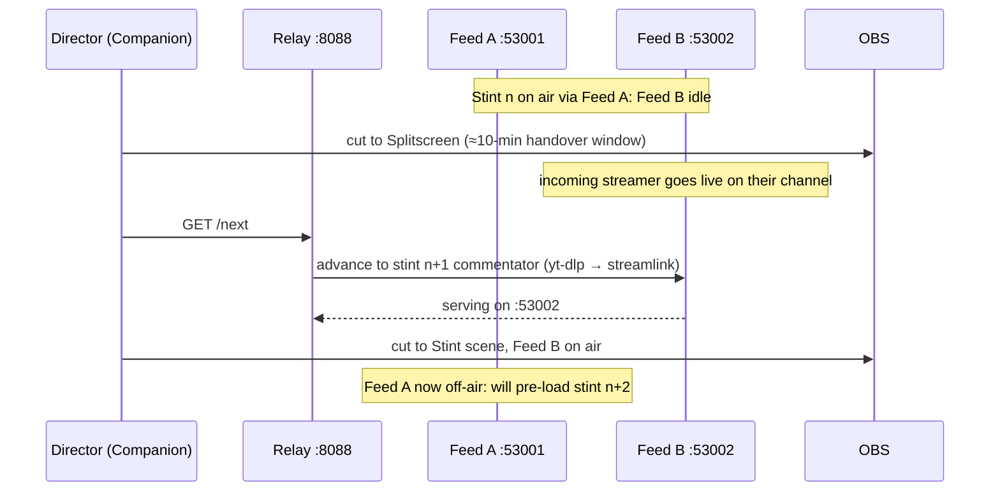

# Architecture

> Technical reference. Just running a show? See [Run an event](Run-an-event).

How the broadcast station fits together, in four views: the **system topology**, the
**relay ping-pong**, the **control flow**, and a **stint handover** over time.

## Core idea

**Source switching keeps full buffering.** Each commentator stream is pulled by the
producer station and served on a *fixed local port*. OBS points at those fixed ports
and never changes URL. The director only switches **scenes/sources**, no URLs are
ever typed, no processes restarted. This gives Streamlink's ring buffer **and** OBS's
own network buffer **and** full remote switching at once.

**Quality: 1080p target, never below 720p.** Streamers ingest at 1080p so YouTube
generates both a 1080p and a 720p rendition; the pull side prefers
`1080p60,1080p,720p60,720p` and will not drop below 720p.

---

## 1. System topology

Streamers push to their own YouTube channels; the producer station pulls them in, composes
the show with overlays and Discord audio, and pushes one broadcast to the league's channel.
Remote directors drive it from a browser over Tailscale, or, without a Tailscale account,
over the public [Funnel](Remote-access). One station can serve several
leagues: each is a **profile** (its own sheet, graphics, overlay CSS and OBS collection);
a resolver picks the active one (`--profile` > `RACECAST_PROFILE` > `runtime/active-profile`
pointer > sole profile).

The producer's only live job: **start and stop** the broadcast. Everything else is
the director's, done remotely.

---

## 2. Relay ping-pong (the endurance flow)

Two fixed feeds "walk" along a **stint schedule**. Feed A serves the odd stints
(1, 3, 5…), Feed B the even ones (2, 4, 6…) (when starting from stint 1; a
`--stint N` takeover starts the same ping-pong at stint N on Feed A). At each handover the **off-air** feed
advances to the next commentator's stream, so the on-air OBS media source never changes
URL. A third **POV** feed is an optional driver picture-in-picture.

A running feed is **never** torn off mid-stint. Sheet edits apply on the next `/next`
(handover) or `/reload`. See [Relay Mode](Relay-Mode) for the operating procedure.

### The HUD overlay

The lower-third HUD is **one** relay-served page.
The relay reads the **Overlay** tab (live values: streamer, session, round, top-3
teams, race control) and the **Configuration** tab (team → manufacturer via a
`Brand Name` column) as gviz CSV, and serves:

- `GET /hud`: a single transparent overlay page (one OBS Browser Source at
  `http://127.0.0.1:8088/hud`),
- `GET /hud/data`: the live values as JSON (the page polls it every ~2.5 s, so sheet
  edits appear with no manual reload),
- `GET /hud/assets/{flags,brands}/<key>`: bundled flag/brand logos, resolved from text.

The `/hud` and `/splitscreen` pages are restyled **per league**: the relay serves the
active profile's `profiles/<name>/overlay/hud.css` (+ an optional `splitscreen.css` and
`overlay/fonts/`) on top of the shared page, so each league can have its own look without
forking the HTML.

The race timer is **part of the HUD**, the clock is drawn inside the `/hud` page (it
polls `/timer/data`), so OBS needs only the one HUD Browser Source, not a separate timer
source. Timer state: Sheet tab `Timer` + the active profile's
`runtime/<profile>/timer.json`, Director-controlled via the `/timer/*` JSON endpoints.

---

## 3. Control flow

The director never touches the producer machine directly. The **director panel** is the
primary control surface (organized as mixer-bus rows); it talks **only to the relay** over
plain HTTP. Scene switches, source visibility and audio are **relay-mediated**: the panel
calls `/obs/{scene,source,audio,state}` and the relay drives OBS over the WebSocket **on the
producer's own machine**, so the panel needs **no OBS IP, port or password**, and the OBS
password never leaves the producer station. Companion offers the same action set as a
hardware-style button board; running on the producer station, it talks to OBS over its
WebSocket directly and to the relay over plain HTTP GETs. Directors can also reach
Companion's web-buttons page at `/console/buttons` over the Funnel (Companion ≥ v4.1.0),
the relay reverse-proxies it (HTTP + WebSocket) behind the director gate; see
[Remote access](Remote-access#companion-web-buttons-over-the-funnel-consolebuttons).

The relay's **root** control surface (`/panel`, `/status`, `/next`, `/set/*`, the feed
ports, `/obs/*`) is **unauthenticated** and bound to `127.0.0.1` plus the Tailscale IP by
default (`--bind auto`): never `0.0.0.0`, because `/status` reveals stream URLs. The
**tailnet is the trust boundary** for that surface.

For crew who are **not** on the tailnet, the relay also serves an authenticated,
role-gated **`/console`** mirror, the *only* path exposed over the public Tailscale Funnel.
One signed link per person, roles resolved live from the Crew tab ∪ Schedule, with a
step-up secret on the few irreversible producer ops. OBS-WebSocket is never funnelled.
Companion's web-buttons page is reachable over the Funnel at `/console/buttons` (director
gate, relay-proxied: a sub-path of the single `/console` mount). See
[Remote access & the Funnel boundary](Remote-access) for the full model.

---

## 4. Stint handover (over time)

What happens at a driver/lobby change, roughly every two hours. The incoming streamer
goes live; the director cuts to splitscreen for the handover window, presses `/next`,
then cuts to the new feed. Nothing is typed.

---

## Ports at a glance

| Port | Service |
|------|---------|
| `53001` | Relay Feed A (odd stints) |
| `53002` | Relay Feed B (even stints) |
| `53003` | Relay POV feed (PiP) |
| `8088`  | Relay control server (HTTP GET endpoints, `/panel`) |
| `4455`  | OBS WebSocket server |
| `8000`  | Companion admin + Web Buttons (`/tablet`) |

See [Set up the broadcast PC](Set-up-the-broadcast-PC) to put all of this on a machine.
