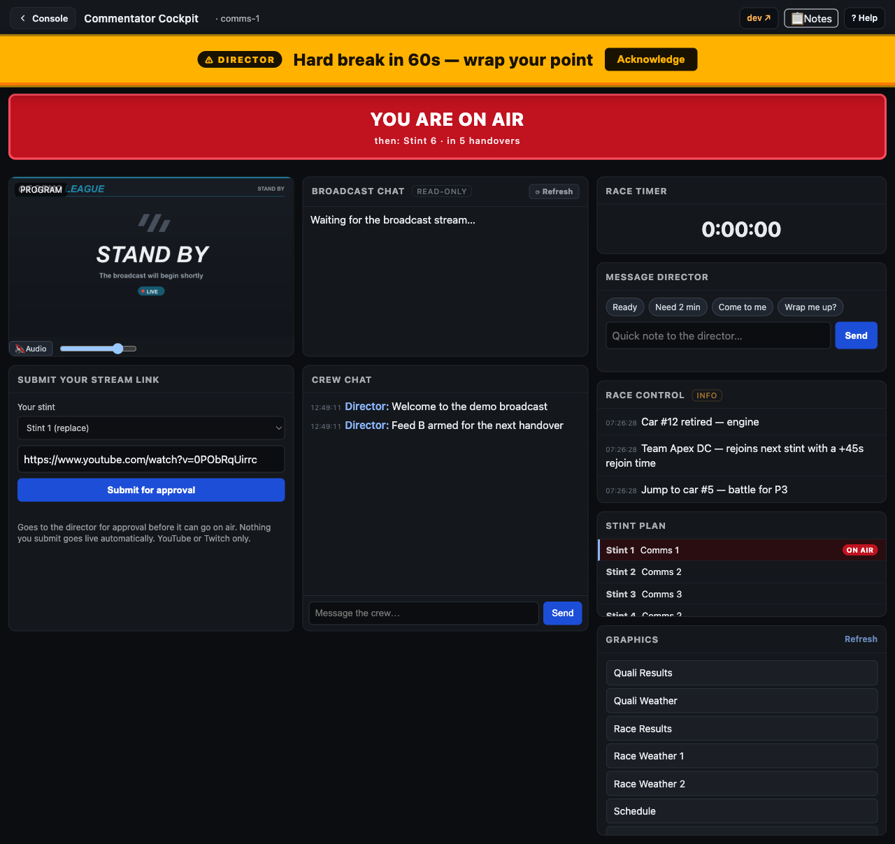

# Commentator Cockpit

> New here? Start with the visual [Commentator onboarding deck ↗](https://jegr78.github.io/gt-racing-broadcast/commentator.html), then come back for the detail below.

A **commentator-facing** page served by the relay, the counterpart to the Director
Panel, but for the **commentators**. Each commentator opens the Console and signs in
(with Discord) to get a self-contained cockpit:

- **Event title**, the round's free-text title (e.g. `GTEC - 2026 - Round 4 -
  Nürburgring 24h`) in the header, the same label the director and Discord see.
  Read-only here; the director sets it (see [Director](Director#event-title)).
- **Live program monitor**, the actual broadcast output (low-bandwidth JPEG stills).
  If the producer's machine falls behind, a yellow note under it says
  `Program is 12 s behind live. The delay is on the producer side, not your stream.`
  It appears only when the delay is past the relay's threshold.
- **Tally**, a large **YOU ARE ON AIR** indicator plus an **UP NEXT · stint N · in
  X handovers** cue (and, while on air, their next own stint).
- **Crew chat**, the same chat as the Director Panel, attributed to the commentator.
- **Race timer**, the live remaining-time clock.
- **Submit a stream link**: propose the stream URL for one of *their own* stints; it
  lands as a pending request the director approves before it can go on air (see below).
- **Graphics**: browse the league's broadcast graphics and open any of them in a new
  browser tab for reference while on air (see below).

You reach your cockpit from the **[Console](Console)** page: open the link your producer
shares and **sign in with Discord**; the cockpit appears as one of its role-gated cards.
(Leagues without Discord login send you a personal sign-in link instead, same result.)

## Director cues

Directors can send short text cues from the panel directly to your cockpit, a
text-only stand-in for an earpiece. Two levels:

- **Info**: appears as a brief auto-fading toast at the top of the cockpit and
  disappears after 30 seconds on its own.
- **Critical**, a large sticky banner that stays on screen until you click
  **Acknowledge**. Once you do, the director's panel shows a **✓ seen** stamp with
  the time.

Cues are **visual only: there is no sound or pop-up alert**. Keep the cockpit open on a
screen you can glance at so you don't miss a critical banner.

You only receive cues addressed to you by name or to **All commentators**: cues sent to
other individual commentators are never shown in your cockpit.

## Submit your stream link

Sending your watch link is the same task described in
[Who does what → commentators](Who-does-what#commentators--streamers): the **preferred
way is from the cockpit**; posting it in the crew **Discord** is the fallback when you
can't reach the cockpit.

From the cockpit you propose the URL for one of **your own** stints: pick the stint, paste
your YouTube/Twitch link, and submit. It is **not** live immediately, it lands as a
*pending request* your director approves (or rejects) first; once approved it goes on air
at the next handover/reload for that feed. You can only ever touch your own stints, never
anyone else's.

> Producer/admin side (approval flow, storage, security): see
> [Console & cockpit setup → stream-link submissions](Console-Setup#commentator-stream-link-submissions-director-approved).

## Graphics

The cockpit lists the league's **broadcast graphics**, the same still graphics the
director puts on air (standings, schedule, results, weather, standby, …). Pick one from
the **Graphics** card and it opens in a **new browser tab** so you can read it while you
commentate; use **Refresh** if the producer re-downloads the graphics during the event.
The list is read-only: opening a graphic never changes anything on air.

## Setup & administration (producers)

Provisioning the cockpit secret, issuing and revoking per-person links, publishing the
public Funnel, and handling stream-link submissions are all on the
[Console & cockpit setup](Console-Setup) page. The access model and the security boundary
(identity vs authorization, the step-up secret, what stays tailnet-only) are in
[Remote access & the Funnel](Remote-access).
