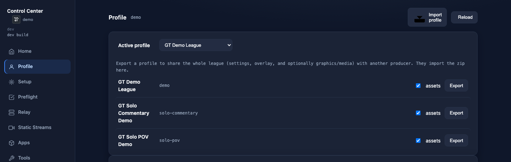
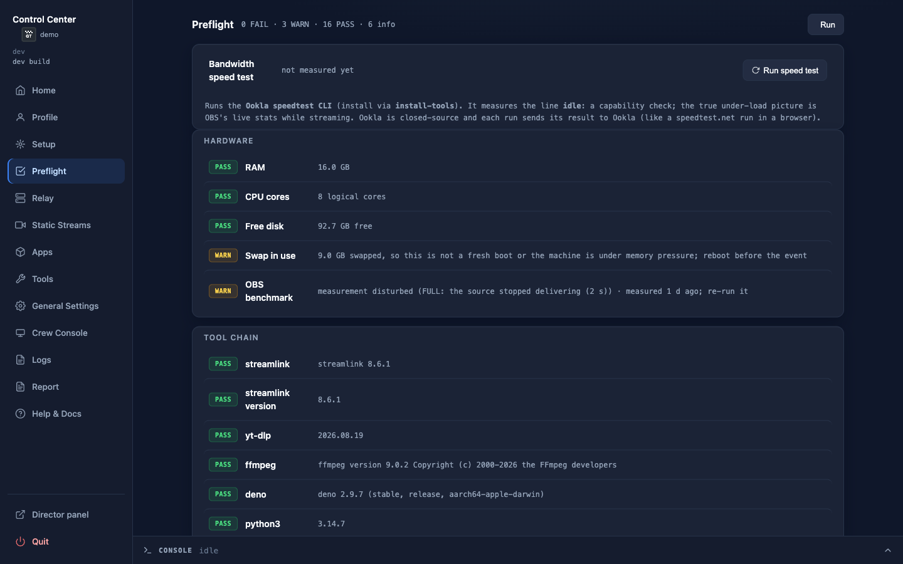
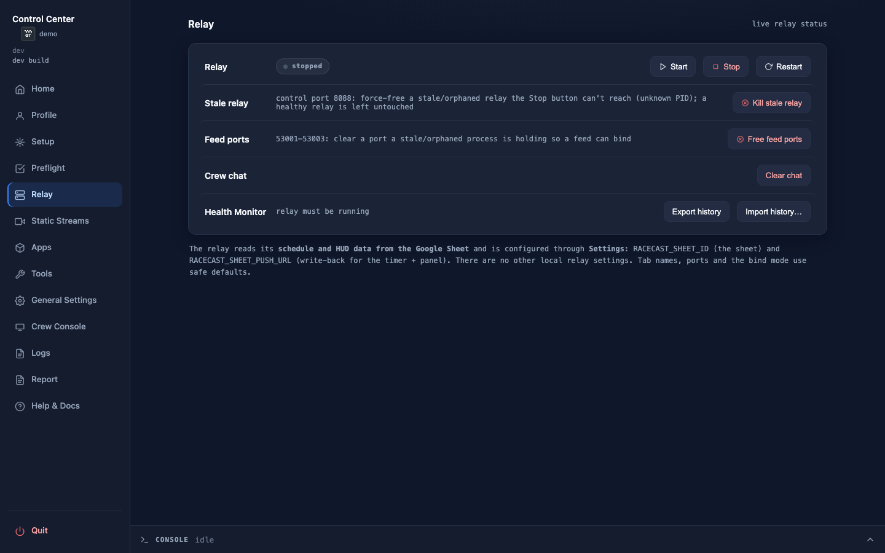
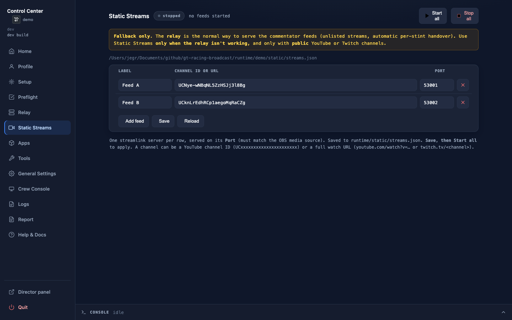
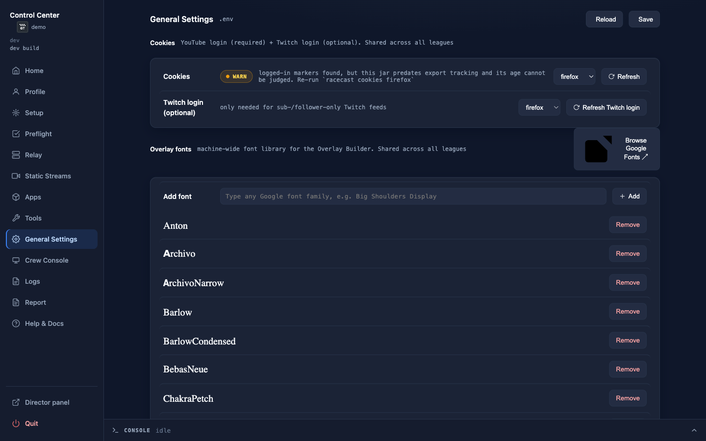
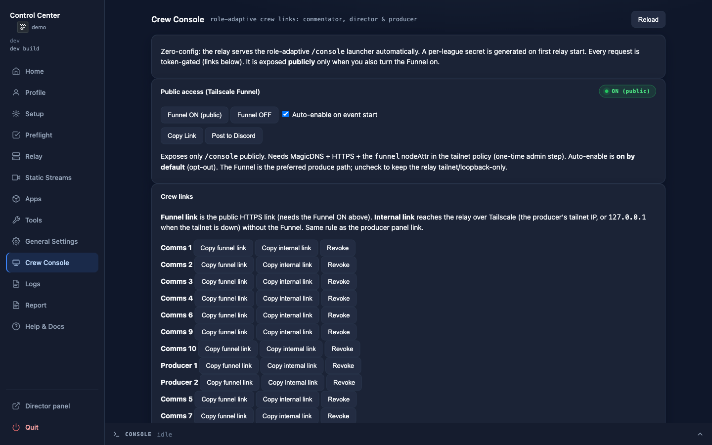
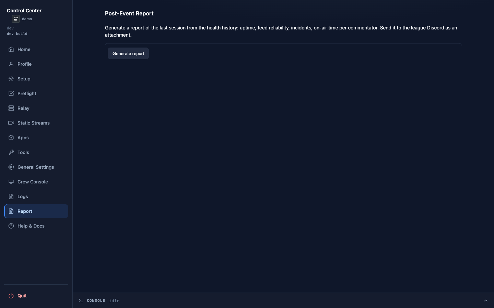
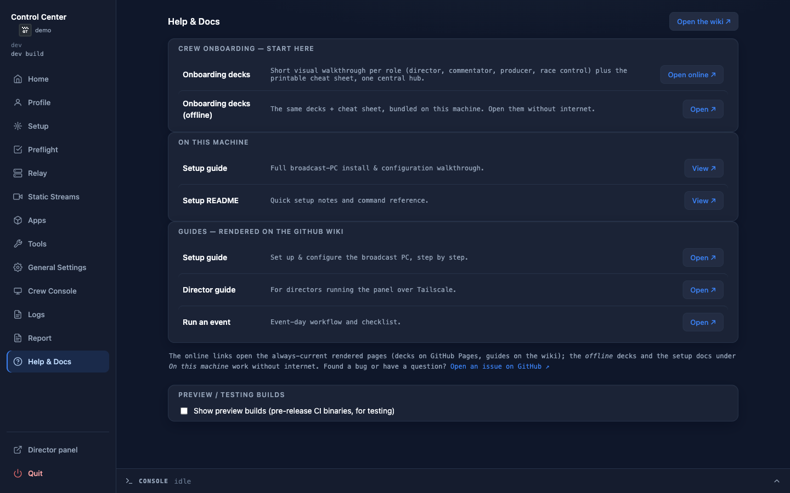

# The Control Center

The **Control Center** is a local web app that runs the whole producer station,
first-time setup, event-day bring-up, service control, logs: from your browser,
no terminal needed. It is the recommended way to drive the station. Everything it
does is also available as a `racecast …` command (shown as a *CLI alternative*
throughout the operator guides), so the terminal stays a first-class option for
Linux, scripting, and remote sessions.

It is shipped in the same release archive as the CLI: alongside the `racecast` binary
you get **`racecast-ui`**, the Control Center launcher.

## Launch it

| Platform | How |
|---|---|
| **Windows** | Double-click **`racecast-ui.exe`**. |
| **macOS** | Double-click **`racecast-ui.app`**. |
| **Linux** | Run `./racecast-ui` (or `./racecast ui`): most Linux desktops don't launch a plain binary on double-click. |

It opens your default browser at `http://127.0.0.1:8089/`. Keep `racecast-ui` in the
same folder as `racecast`, your `.env` and `profiles/`, the two binaries sit side by
side and share the `runtime/` folder next to them.

- **Already running?** Launching again just reopens the browser: there is only
  ever one Control Center per machine.
- **Closing the tab** leaves it running in the background. Use the **Quit**
  button (bottom-left) to stop the server. Stopping the Control Center does *not*
  stop the relay, Companion, or streams: those are independent and keep running.
- **Port busy?** Set `RACECAST_UI_PORT` in `.env` to a free port and relaunch.

> **CLI alternative:** `racecast ui` runs the same server in a terminal (add
> `--no-browser` to skip opening a tab). `racecast ui` and `racecast-ui` are interchangeable.

## Security: keep it local

The Control Center listens on `127.0.0.1` only (this machine). Its API is
unauthenticated and can start installs and stop services, so it is deliberately
**not** reachable from the LAN or the tailnet. Don't put it behind a proxy or
forward its port. (The director's panel and Companion Web Buttons *are* reached over
Tailscale: those are separate, see [Director setup](Director-Setup).)

## A tour of the views

The left sidebar holds every view. The docked **Console** at the bottom streams
the live output of any action you run.

### Home

The dashboard. At a glance: how many core services are up, the state of Tailscale,
Discord, OBS, the relay, Companion and the static streams, the race-timer state,
and tiles for Preflight / Assets / Cookies readiness. **Start event** brings the
station up (optional stint number for a mid-event takeover); **Stop event** winds
the `racecast` services down. The sidebar also shows the **active league profile**
(click it to jump to the Profile view). From here you also open the Director panel
and copy the director / Web Buttons links.

#### System

A live machine-resource card shows the producer machine's **CPU %**, **RAM** (used /
total and a percentage), **Network ↑/↓**, and **Disk free**. Readings are color-coded:
CPU turns yellow above 75 % and red at 90 % or above; RAM turns yellow above 80 % and
red at 92 % or above; Disk free turns yellow below 5 GB and red below 2 GB. Network
throughput is informational and carries no color. The card updates whenever the Control
Center is open, whether or not the relay is running, the machine-resource history charts
in the [Health Monitor](Health-Monitor), by contrast, are recorded by the relay.

> **CLI alternative:** `racecast status`, `racecast event start [--stint N]`, `racecast event stop`.

### Profile

Everything that belongs to a **league**, gathered in one view (the model behind it is in
[League profiles](Profiles)):

- **Active profile**, a switcher to change the active league (every other view then
  acts on it), and a **New profile** dialog. Pick the **Kind**: an *Endurance* profile
  copies an existing one (e.g. `example`) into a new league; a *Solo* profile (single-race
  commentary or driver POV: local capture + webcam, no feeds) generates a fresh profile
  from a **Template** (Commentary or POV) instead of copying. Selecting *Solo* swaps the
  *Copy from* control for the *Template* picker.
- **`profile.env` editor**, the active league's config (Sheet ID, push URL,
  intro/outro, logo, and the OBS scene-collection name `OBS_COLLECTION`). Secret values
  are **masked**: click the eye to reveal one. **Open Sheet ↗** opens this league's Google
  Sheet (built from `SHEET_ID`) in a new tab, no need to keep the raw link around. Changes
  apply the next time you (re)start the relay.
- **Overlay CSS**: per-profile CSS for the relay-served **HUD** and **Timer** pages
  (`profiles/<active>/overlay/`; see [HUD overlays](HUD-Overlays)). **Save** writes the file;
  **Apply in OBS** reloads the browser sources (same as `obs refresh`). The first override on
  a profile that had no `overlay/` yet needs one `racecast relay restart` to activate; later
  edits apply live.
- **Crew editor**: reads the league Sheet's `Crew` tab
  (`Name | Commentator | Director | Producer | Race Control | Discord`) via the relay and
  lets the producer set the per-person role flags; changes are written back to the Sheet
  via the `crew` webhook action. **Race Control** flags a person for the read-only
  [Race Control](Console) monitoring desk. The Crew tab and the redeployed Apps Script
  `crew` action are a league Sheet-side coordination item (see [Sheet-Webhook](Sheet-Webhook));
  without them roles degrade gracefully.

- **Assets**, the active profile's broadcast graphics and intro/outro media. Thumbnails
  show which graphics are present; **Download** fetches them from the Sheet's Assets tab;
  **Check vs sheet** compares what's on disk against what the Sheet lists.

> **CLI alternative:** `racecast profile list|show|use|new`, `racecast graphics`,
> `racecast media`, `racecast sheet open` (or `sheet url`). Edit
> `profiles/<name>/profile.env` and `profiles/<name>/overlay/{hud,timer}.css` in any
> text editor.

### Setup

The first-time-setup **wizard**. It detects what is already done and marks each
step `done` or `pending`, with a running "*X of N complete*" summary. Run the
pending steps in order: creating/selecting a league profile, installs, YouTube
cookies, broadcast graphics, intro/outro media, the OBS scene collection, the
Companion config: each streams its
output in the Console. **Re-check all** re-reads the state (e.g. after you fill in
the active profile's `SHEET_ID`). The closing **Manual next steps** list covers the
imports no script can do (importing the OBS collection and Companion config, signing in
to Tailscale).

> **CLI alternative:** `racecast init` runs the same steps in the terminal.

### Preflight

A read-only hardware and tooling check: RAM, CPU, disk, swap; the four command-
line tools (`yt-dlp`, `streamlink`, `ffmpeg`, `deno`) with versions; and the four
apps (OBS, Companion, Tailscale, Discord). Each line is `PASS` / `WARN` / `INFO` /
`FAIL`. **Run** re-checks.

> **CLI alternative:** `racecast preflight`.

### Relay & Static Streams

**Relay** starts / stops / restarts the commentator-feed relay (the normal mode)
and shows its live status. It reads its schedule and HUD data from the **active
profile's** Google Sheet, and applies that profile's overlay CSS; there are no local
relay knobs: ports and bind mode use safe defaults.

**Static Streams** is the **fallback** for plain public channels when the relay
mode can't be used. Edit the channel/port list here and start/stop the set.

> **CLI alternative:** `racecast relay start|stop|restart|status|logs`,
> `racecast streams start|stop`.

### Apps & Tools

**Apps** installs, launches, quits and shows the status of OBS, Companion,
Tailscale and Discord. **Tools** does the same for the command-line tools
(`yt-dlp`, `streamlink`, `ffmpeg`, `deno`), with **Install all** / **Update all**.

> **CLI alternative:** `racecast install-apps`, `racecast install-tools` (add `--update` to
> upgrade), `racecast app launch|quit obs|discord|tailscale`.

### General Settings

Machine-wide (not league) configuration:

- A safe editor for the local `.env` (this machine only. OBS-WebSocket password,
  Control Center port, the Windows Companion path). Secret values are **masked**: click
  the eye to reveal one. Comments in the file are preserved. Changes apply the next time
  you (re)start the affected service.
- **YouTube cookies**: freshness status, re-exported with **Refresh** (pick the browser).

> **CLI alternative:** edit `.env` in any text editor; `racecast cookies <browser>`.

### Crew Console

Where you hand out crew access. The relay serves a **role-adaptive `/console`** launcher;
crew **sign in with Discord** (the standard) or via a per-person link (the fallback), and
land on the surface their roles allow (commentator cockpit, director panel, Race Control
desk). The per-league secret behind it is generated automatically on the first relay start,
so this view is **zero-config**.

- **Public access (Tailscale Funnel)**: `/console` is reachable over the tailnet by default;
  flip the **Funnel ON** to also expose **only** `/console` publicly (so crew off the tailnet
  can open their link). **Auto-enable on event start** turns it on with every event, and is
  **checked by default** (opt-out), since the Funnel is the preferred produce path; uncheck it
  to keep a machine tailnet/loopback-only. **Copy Link** / **Post to Discord** distribute the
  shared launcher link in one click.
- **Crew links**, one row per person (the Crew tab ∪ the live schedule), for the per-person
  fallback (leagues without Discord login). **Copy funnel link** copies their public HTTPS
  link, **Copy internal link** the tailnet/loopback one, and **Revoke** rotates a single
  person's link (bumps their version), which also invalidates their Discord session, without
  touching anyone else.

Roles per person come from the [Crew editor](#profile) (and the Schedule). Start the relay
first: links and the secret only exist once it is running.

> **CLI alternative:** `racecast links` (add `--post` to drop them into crew chat),
> `racecast funnel on|off`, `racecast console token revoke <streamer>`. See [Console](Console)
> and [Commentator Cockpit](Commentator-Cockpit) for what the crew sees.

### Logs

Live tail of the relay, Companion and static-stream logs: pick a source from the
dropdown. The example above shows a healthy relay startup: the schedule loaded from
the Google Sheet and both feeds bound, with the HUD and Director-panel URLs listed.

> **CLI alternative:** `racecast relay logs -f` (and `companion` / `streams`).

### Post-Event Report

A summary of the last broadcast session: commentators per stint, Feed A / Feed B
activity, incidents and quality metrics: generated from the relay's health history.
The artifact is a **self-contained HTML file** (all assets inline) that opens in any
browser without a server.

Click **Generate** to build the report. The preview panel shows a formatted text
summary. **Download .html** saves the file to your machine; **Send to Discord** posts
the HTML file as an attachment to the league's Discord webhook channel. Discord shows
it as a downloadable attachment that recipients open in a browser.

> **CLI alternative:** `racecast report` (generate into `runtime/<profile>/reports/`),
> `racecast report send [FILE]` (send the newest or a given file to Discord).

### Help & Docs

**Start here** opens the visual [onboarding decks](https://jegr78.github.io/gt-racing-broadcast/),
one short walkthrough per role plus the printable cheat sheet, all in one central place.
**On this machine** lists the bundled setup guides (rendered offline, no internet needed),
and the guide links open the always-current pages on this wiki.

## Where to go next

- **Setting up a machine?** → [Set up the broadcast PC](Set-up-the-broadcast-PC)
- **Running a show today?** → [Run an event](Run-an-event)
- **The remote director?** → [Director setup](Director-Setup), then the
  [Director guide](Director)

---

> This page is generated from `src/docs/wiki/` in the
> [main repository](https://github.com/jegr78/gt-racing-broadcast): don't edit it
> here by hand. See [Build & maintenance](Build-and-maintenance).
