# The Control Center

The **Control Center** is a local web app that runs the whole producer station,
first-time setup, event-day bring-up, service control, logs: from your browser,
no terminal needed. It is the recommended way to drive the station. Everything it
does is also available as a `racecast …` command (shown as a *CLI alternative*
throughout the operator guides), so the terminal stays a first-class option for
Linux, scripting, and remote sessions.

It is shipped in the same release archive as the CLI: alongside the `racecast` binary
you get **`racecast-ui`**, the Control Center launcher.

## Launch it

| Platform | How |
|---|---|
| **Windows** | Double-click **`racecast-ui.exe`**. |
| **macOS** | Double-click **`racecast-ui.app`**. |
| **Linux** | Run `./racecast-ui` (or `./racecast ui`): most Linux desktops don't launch a plain binary on double-click. |

It opens your default browser at `http://127.0.0.1:8089/`. Keep `racecast-ui` in the
same folder as `racecast`, your `.env` and `profiles/`, the two binaries sit side by
side and share the `runtime/` folder next to them.

- **Already running?** Launching again just reopens the browser: there is only
  ever one Control Center per machine.
- **Closing the tab** leaves it running in the background. Use the **Quit**
  button (bottom-left) to stop the server. Stopping the Control Center does *not*
  stop the relay, Companion, or streams: those are independent and keep running.
- **Port busy?** Set `RACECAST_UI_PORT` in `.env` to a free port and relaunch.

> **CLI alternative:** `racecast telemetry export <name>` writes samples/laps CSV with a current
> `context.json` snapshot, excluding drafts/history. `--diagnostics` adds `diagnostics.csv`.
> Existing `samples.csv` columns remain at the start; confirmed channels and `__state` columns follow.
> `channels.json` documents schema version, units, offsets, sentinels and compatibility columns.
> Missing, unset and nonfinite values have blank numerical cells and distinct state values; genuine zero remains zero.
> The historical `throttle_input_pct` and `brake_input_pct` names remain for compatibility, with their disputed
> driver/filter interpretation documented. Neither represents a newly verified driver-input sensor.
> `racecast telemetry index` builds the missing lap caches ahead of time.

## Security: keep it local

The Control Center listens on `127.0.0.1` only (this machine). Its API is
unauthenticated and can start installs and stop services, so it is deliberately
**not** reachable from the LAN or the tailnet. Don't put it behind a proxy or
forward its port. (The director's panel and Companion Web Buttons *are* reached over
Tailscale: those are separate, see [Director setup](Director-Setup).)

## A tour of the views

The left sidebar holds every view. The docked **Console** at the bottom streams
the live output of any action you run.

### Home

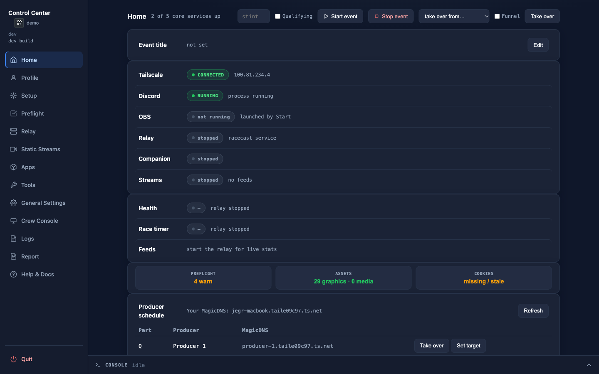

The dashboard. At a glance: how many core services are up, the state of Tailscale,
Discord, OBS, the relay, Companion and the static streams, the race-timer state,
and tiles for Preflight / Assets / Cookies readiness. **Start event** brings the
station up (optional stint number for a mid-event takeover); **Stop event** winds
the `racecast` services down. The sidebar also shows the **active league profile**
(click it to jump to the Profile view). From here you also open the Director panel
and copy the director / Web Buttons links.

#### System

A live machine-resource card shows the producer machine's **CPU %**, **RAM** (used /
total and a percentage), **Network ↑/↓**, and **Disk free**. Readings are color-coded:
CPU turns yellow above 75 % and red at 90 % or above; RAM turns yellow above 80 % and
red at 92 % or above; Disk free turns yellow below 5 GB and red below 2 GB. Network
throughput is informational and carries no color. The card updates whenever the Control
Center is open, whether or not the relay is running, the machine-resource history charts
in the [Health Monitor](Health-Monitor), by contrast, are recorded by the relay.

> **CLI alternative:** `racecast status`, `racecast event start [--stint N]`, `racecast event stop`.

### Profile

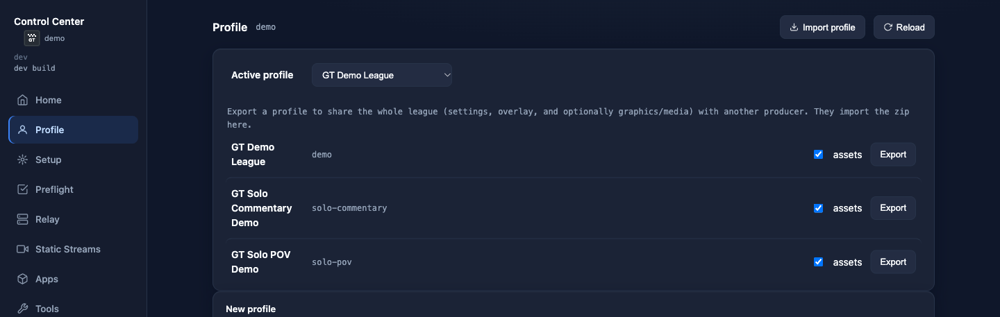

Everything that belongs to a **league**, gathered in one view (the model behind it is in
[League profiles](Profiles)):

- **Active profile**, a switcher to change the active league (every other view then
  acts on it), and a **New profile** dialog. Pick the **Kind**: an *Endurance* profile
  copies an existing one (e.g. `example`) into a new league; a *Solo* profile (single-race
  commentary or driver POV: local capture + webcam, no feeds) generates a fresh profile
  from a **Template** (Commentary or POV) instead of copying. Selecting *Solo* swaps the
  *Copy from* control for the *Template* picker.
- **`profile.env` editor**, the active league's config (Sheet ID, push URL,
  intro/outro, logo, and the OBS scene-collection name `OBS_COLLECTION`). Secret values
  are **masked**: click the eye to reveal one. **Open Sheet ↗** opens this league's Google
  Sheet (built from `SHEET_ID`) in a new tab, no need to keep the raw link around. Changes
  apply the next time you (re)start the relay.
- **Overlay CSS**: per-profile CSS for the relay-served **HUD** and **Timer** pages
  (`profiles/<active>/overlay/`; see [HUD overlays](HUD-Overlays)). **Save** writes the file;
  **Apply in OBS** reloads the browser sources (same as `obs refresh`). The first override on
  a profile that had no `overlay/` yet needs one `racecast relay restart` to activate; later
  edits apply live.
- **Crew editor**: reads the league Sheet's `Crew` tab
  (`Name | Commentator | Director | Producer | Race Control | Discord`) via the relay and
  lets the producer set the per-person role flags; changes are written back to the Sheet
  via the `crew` webhook action. **Race Control** flags a person for the read-only
  [Race Control](Console) monitoring desk. The Crew tab and the redeployed Apps Script
  `crew` action are a league Sheet-side coordination item (see [Sheet-Webhook](Sheet-Webhook));
  without them roles degrade gracefully.

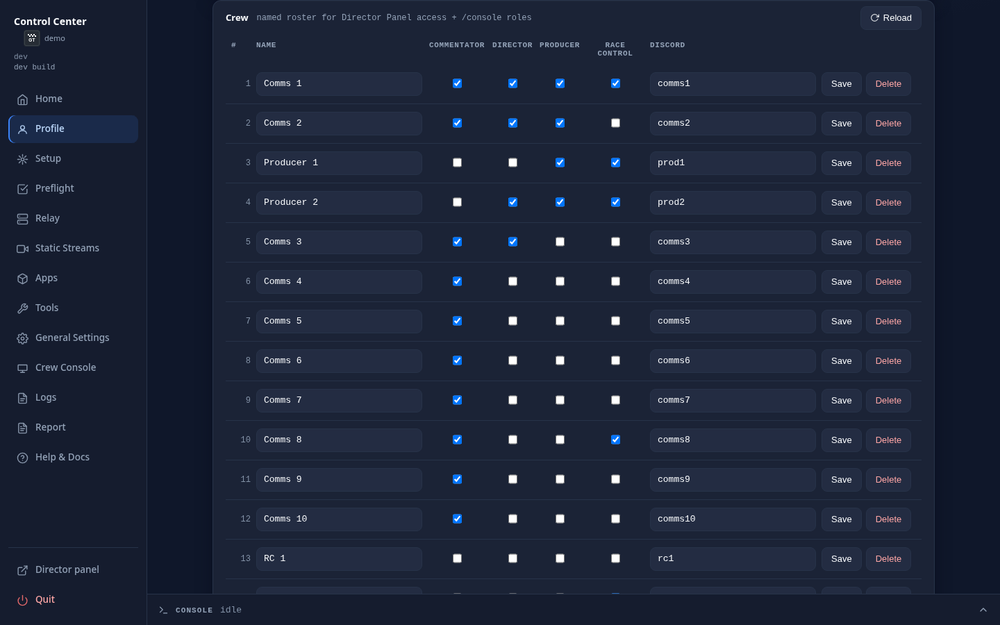

- **Assets**, the active profile's broadcast graphics and intro/outro media. Thumbnails
  show which graphics are present; **Download** fetches them from the Sheet's Assets tab;
  **Check vs sheet** compares what's on disk against what the Sheet lists.

> **CLI alternative:** `racecast profile list|show|use|new`, `racecast graphics`,
> `racecast media`, `racecast sheet open` (or `sheet url`). Edit
> `profiles/<name>/profile.env` and `profiles/<name>/overlay/{hud,timer}.css` in any
> text editor.

### Setup

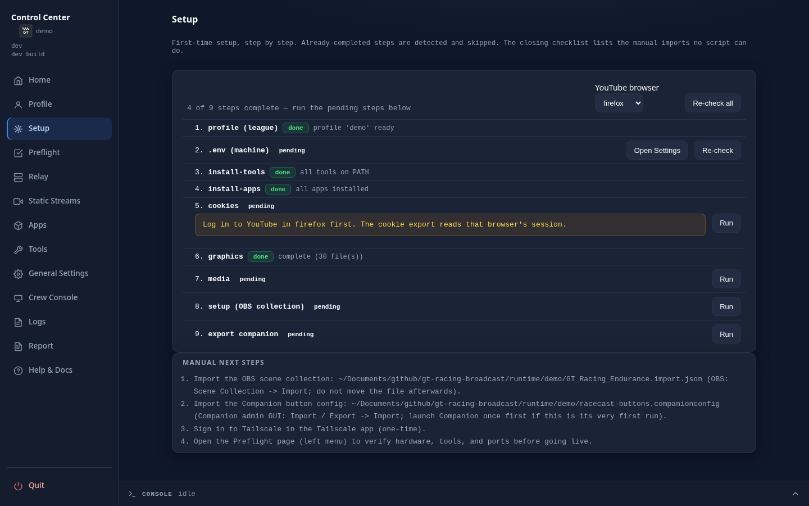

The first-time-setup **wizard**. It detects what is already done and marks each
step `done` or `pending`, with a running "*X of N complete*" summary. Run the
pending steps in order: creating/selecting a league profile, installs, YouTube
cookies, broadcast graphics, intro/outro media, the OBS scene collection, the
Companion config: each streams its
output in the Console. **Re-check all** re-reads the state (e.g. after you fill in
the active profile's `SHEET_ID`). The closing **Manual next steps** list covers the
imports no script can do (importing the OBS collection and Companion config, signing in
to Tailscale).

> **CLI alternative:** `racecast init` runs the same steps in the terminal.

### Preflight

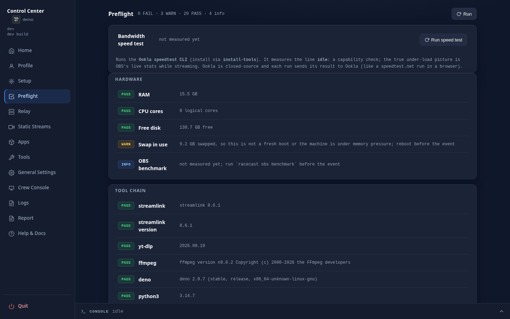

A read-only hardware and tooling check: RAM, CPU, disk, swap; the four command-
line tools (`yt-dlp`, `streamlink`, `ffmpeg`, `deno`) with versions; and the four
apps (OBS, Companion, Tailscale, Discord). Each line is `PASS` / `WARN` / `INFO` /
`FAIL`. **Run** re-checks.

> **CLI alternative:** `racecast preflight`.

### Relay & Static Streams

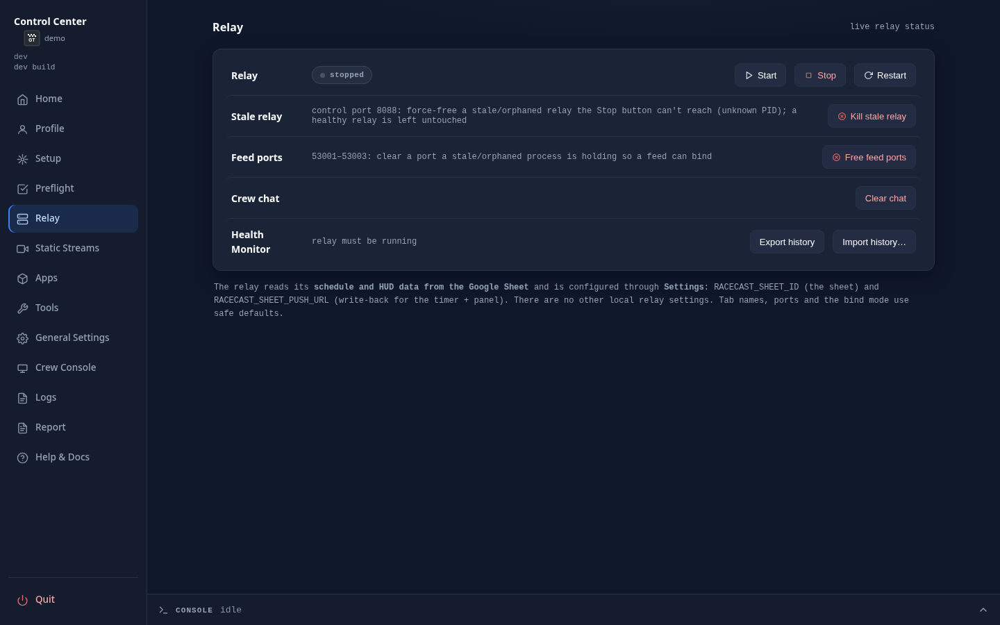

**Relay** starts / stops / restarts the commentator-feed relay (the normal mode)
and shows its live status. It reads its schedule and HUD data from the **active
profile's** Google Sheet, and applies that profile's overlay CSS; there are no local
relay knobs: ports and bind mode use safe defaults.

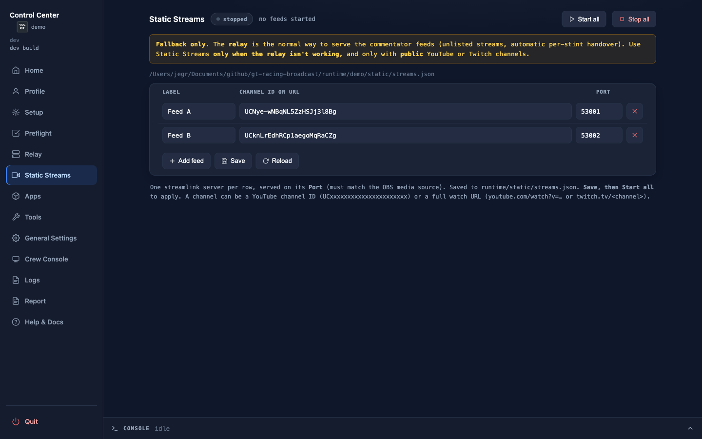

**Static Streams** is the **fallback** for plain public channels when the relay
mode can't be used. Edit the channel/port list here and start/stop the set.

> **CLI alternative:** `racecast relay start|stop|restart|status|logs`,
> `racecast streams start|stop`.

### Apps & Tools

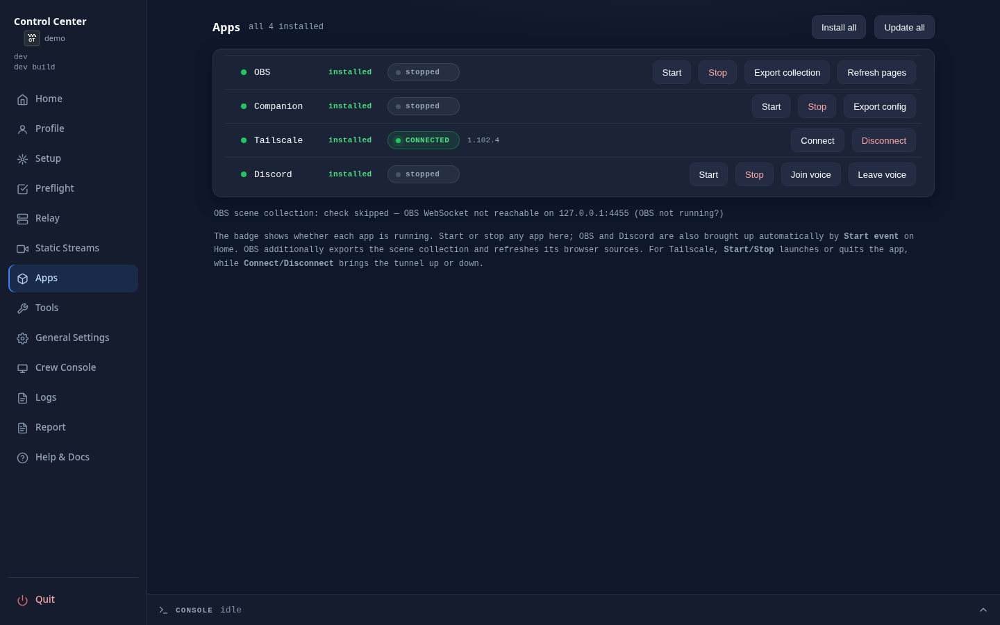

**Apps** installs, launches, quits and shows the status of OBS, Companion,
Tailscale and Discord. **Tools** does the same for the command-line tools
(`yt-dlp`, `streamlink`, `ffmpeg`, `deno`), with **Install all** / **Update all**.

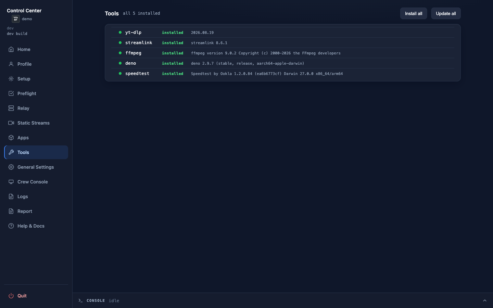

> **CLI alternative:** `racecast install-apps`, `racecast install-tools` (add `--update` to
> upgrade), `racecast app launch|quit obs|discord|tailscale`.

### General Settings

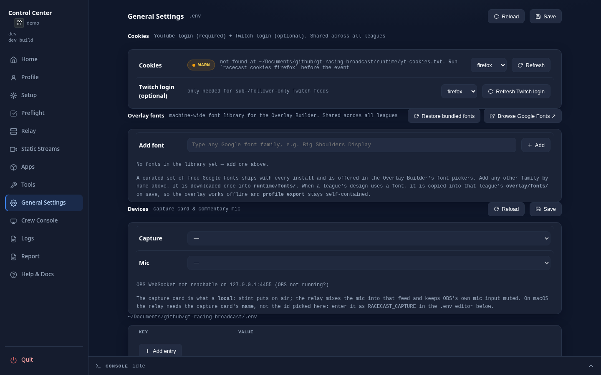

Machine-wide (not league) configuration:

- A safe editor for the local `.env` (this machine only. OBS-WebSocket password,
  Control Center port, the Windows Companion path). Secret values are **masked**: click
  the eye to reveal one. Comments in the file are preserved. Changes apply the next time
  you (re)start the affected service.
- **YouTube cookies**: freshness status, re-exported with **Refresh** (pick the browser).
- **Devices**: **Reload** lists the video and audio devices OBS sees; pick the **capture
  card** (what a [local capture stint](Relay-Mode#local-capture-stint) puts on air) and the
  **commentary mic**, then **Save** (writes `RACECAST_CAPTURE`, `RACECAST_MIC` and
  `RACECAST_MIC_NAME`). A solo profile adds the webcam; a solo commentary profile also
  the tyres/fuel capture, a solo POV profile the GT7 PlayStation IP.
- **GT7 data** shows when the car and track data were last checked and how many cars and
  layouts it knows. **Update now** fetches the latest copy in the background (the row says
  "updating…" until it ends, a failed file opens a message); a running relay uses it
  within a minute.

> **CLI alternative:** edit `.env` in any text editor; `racecast cookies <browser>`;
> `racecast device-scan`.

### Crew Console

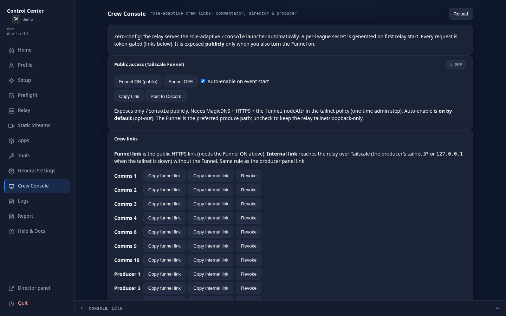

Where you hand out crew access. The relay serves a **role-adaptive `/console`** launcher;
crew **sign in with Discord** (the standard) or via a per-person link (the fallback), and
land on the surface their roles allow (commentator cockpit, director panel, Race Control
desk). The per-league secret behind it is generated automatically on the first relay start,
so this view is **zero-config**.

- **Public access (Tailscale Funnel)**: `/console` is reachable over the tailnet by default;
  flip the **Funnel ON** to also expose **only** `/console` publicly (so crew off the tailnet
  can open their link). **Auto-enable on event start** turns it on with every event, and is
  **checked by default** (opt-out), since the Funnel is the preferred produce path; uncheck it
  to keep a machine tailnet/loopback-only. **Copy Link** / **Post to Discord** distribute the
  shared launcher link in one click.
- **Crew links**, one row per person (the Crew tab ∪ the live schedule), for the per-person
  fallback (leagues without Discord login). **Copy funnel link** copies their public HTTPS
  link, **Copy internal link** the tailnet/loopback one, and **Revoke** rotates a single
  person's link (bumps their version), which also invalidates their Discord session, without
  touching anyone else.

Roles per person come from the [Crew editor](#profile) (and the Schedule). Start the relay
first: links and the secret only exist once it is running.

> **CLI alternative:** `racecast links` (add `--post` to drop them into crew chat),
> `racecast funnel on|off`, `racecast console token revoke <streamer>`. See [Console](Console)
> and [Commentator Cockpit](Commentator-Cockpit) for what the crew sees.

### Logs

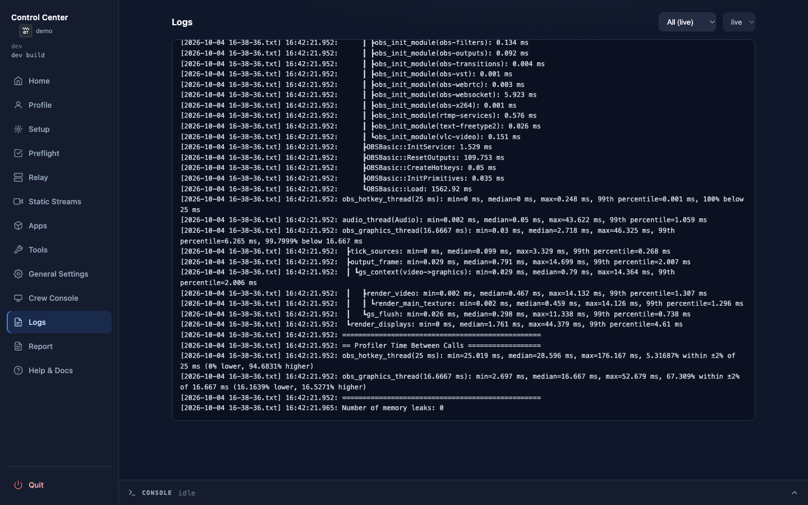

Live tail of the relay, Companion and static-stream logs: pick a source from the
dropdown. The example above shows a healthy relay startup: the schedule loaded from
the Google Sheet and both feeds bound, with the HUD and Director-panel URLs listed.

> **CLI alternative:** `racecast relay logs -f` (and `companion` / `streams`).

### Post-Event Report

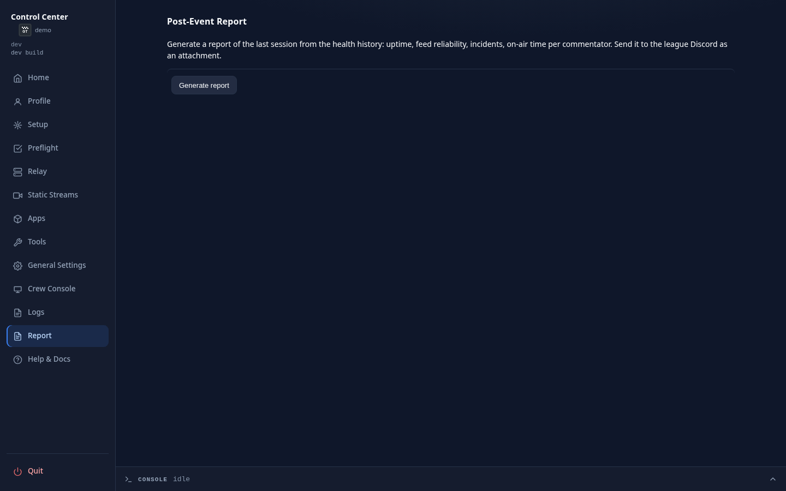

A summary of the last broadcast session: commentators per stint, Feed A / Feed B
activity, incidents and quality metrics: generated from the relay's health history.
The artifact is a **self-contained HTML file** (all assets inline) that opens in any
browser without a server.

Click **Generate** to build the report. It runs `racecast report` as a background job;
for a solo POV profile that also indexes the GT7 recordings in the report window, about
16 s per 3 h of recording not yet indexed. The preview panel then shows the report.
**Download .html** saves the file to your machine; **Send to Discord** posts the HTML
file as an attachment to the league's Discord webhook channel. Discord shows it as a
downloadable attachment that recipients open in a browser.

> **CLI alternative:** `racecast report` (generate into `runtime/<profile>/reports/`),
> `racecast report send [FILE]` (send the newest or a given file to Discord).

### Telemetry

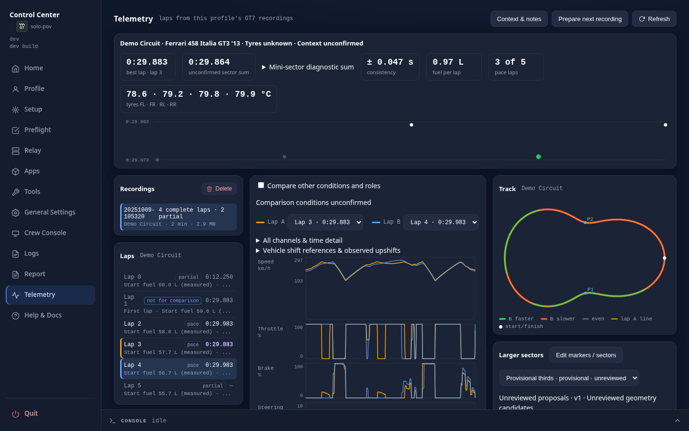

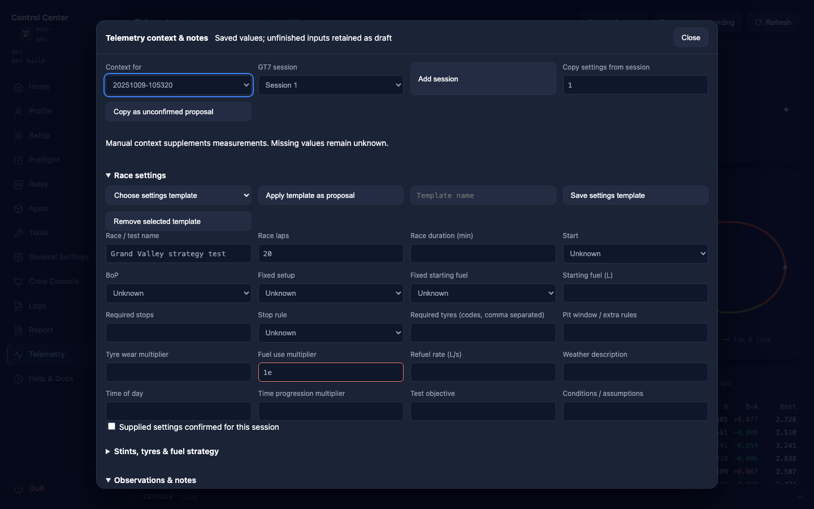

Solo POV profiles only. The view reads the profile's GT7 telemetry recordings
(`runtime/<profile>/telemetry-recordings/`, see [Relay mode](Relay-Mode)) and needs no
running relay.

- **Summary.** Above the comparison, the figures of the post-event report for the picked
  recording, one block per track and car: best lap, theoretical best, consistency
  (standard deviation of the counted lap times), fuel per lap, counted laps, the average
  tyre temperatures and the lap-time trend in driving order (the best lap green, laps that
  were not counted grey). Click a dot in the trend to make that lap lap B.
- **Recordings and laps.** Pick a recording, newest first, to list its laps with time.
  `ref` marks a lap that was the fastest so far when it was driven (the live HUD delta ran
  against it), `not counted` a rejected lap with the reason below it. The fastest counted
  lap is purple, lap A carries an orange bar and lap B a blue one. A lap names its car or
  track only when it differs from the rest of the recording. The first
  open shows "Indexing…" while the view runs the index job, the same as `racecast
  telemetry index`: it replays the recording once and caches the result next to it as
  `<stem>.laps.json`. Later opens are instant until the recording or the GT7 track data
  changes. A recording the job cannot read shows the job's reason instead of its laps.
  The recording the relay is still writing shows as `(recording)` and cannot be picked:
  it stays out of every comparison, and the view analyses it only after the recording
  stops.
- **Delete a recording.** **Delete** on the Recordings card removes the selected
  recording, its context and context history, CSV export, lap index, recording-owned AI analyses and their input packages after a confirmation, the same as
  `racecast telemetry delete <name>`. It cannot be undone. The recording the relay is
  still writing cannot be deleted: stop the recording first. While an AI analysis is
  active, cancel it or wait before deleting recordings. Shared machine agent settings
  remain available. Reference snapshots already frozen in another recording's report
  stay with that report and become stale if their source disappears.

  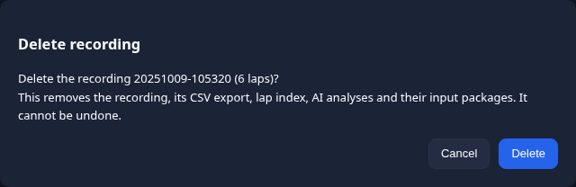

- **Context & notes.** Add race settings, per-session confirmations, stints, fuel maps,
  intentional shortshifting and notes before, during or after capture. The context editor
  can select an active recording even while its lap analysis is unavailable. Recording
  notes apply to the whole file; session and lap notes keep their own scope. Hover a chart
  before opening the editor to attach that position to a note for the selected lap.
  Valid edits save automatically; unfinished numeric inputs remain drafts. Concurrent
  edits report a conflict and retain your local draft. Earlier whole-context revisions
  can be restored as a new revision. Measurements and raw capture bytes remain unchanged.
- **Prepare next recording and templates.** Preparation attaches once to the next capture.
  Templates copy settings into the selected session as an unconfirmed proposal; changing
  a template does not change existing recordings. Copying another session also requires
  fresh confirmation and does not carry over its stint boundaries. Missing values remain
  unknown. Templates and preparation belong to the profile.
- **Stint service and comparison.** Enter the lap and optional recording time at which
  service occurred. Temperature resets, refuelling and standstill produce proposed times,
  never confirmed tyre compounds. A pit lap can contain both RM and RH. Each confirmed
  tyre change has a configurable number of complete warmup laps (including zero).
  Each lap shows its measured starting fuel load and the number of lap boundaries since
  the declared initial stint or last confirmed tyre change. This tyre-age proxy includes
  a partial service lap and does not establish prior wear at capture start or a wear percentage.
  It does not assume equal conditions. Default
  comparisons exclude contextual first, pit and warmup laps, mixed known fuel strategies within a lap, different confirmed
  compounds and known differences in race settings or fuel strategy. **Compare other
  conditions / roles** explicitly broadens the pool; numerical quality checks still apply.
  Unknown context remains inspectable and is labelled unconfirmed. Reports group known
  compounds, conditions and strategies separately.
- **Capture and pace.** Every recorded segment remains selectable, including the
  partial segment before the first lap and the unfinished segment after the last lap.
  An unfinished segment shows captured seconds, not an invented completed lap time.
  Capture completeness, distance-trace coverage and pace eligibility are separate.
  Both `reference` and `counted` admit a regular lap; **best so far** marks a historical
  live reference, not a stronger data-quality verdict. Pit laps show all detected
  reasons. **After inferred service; tyres unconfirmed** identifies the next lap without
  claiming a confirmed tyre change or warmup period.
- **Lap clock.** Complete pace traces include the closing boundary sample. Their entire
  receiver-clock interval is normalized to the matched GT7 lap duration, beginning at
  zero and ending at that duration. This prevents a backwards final sector when receiver
  timing differs from GT7. Raw packet times and GT7 lap times are preserved; this is a
  reconciled comparison clock, not a claim that every network arrival was a simulation tick.
- **Lap A and lap B.** Lap B is the lap you click. Lap A starts as the fastest counted
  lap other than B with the same track and car across all recordings of the profile.
  Both pickers list every comparable counted lap; B also shows the clicked lap when it
  is not counted. When B has no such partner, lap A
  reads "no other lap to compare" and the charts show B alone. Laps on an unknown track
  compare only within their GT7 session. When other recordings have no cached laps yet,
  for example after a Set track, the view runs the index job first ("Indexing
  N recordings…"). No request rebuilds the full recording index: loading a lap or
  setting a track on a recording without cached laps also waits for that job.
- **Charts.** Speed, throttle, brake, steering, gear and the delta of B against A over
  lap distance, each with its value range on the left. Below zero B is ahead, above zero
  behind; the delta panel ends with the final gap. Hover to read both laps at one point;
  the map shows where that point is.
- **All channels & time detail.** Open this section and select up to eight values,
  including constants, clutch/gearbox data and simulator flags. Distance is the default
  comparison axis. A time window spans at most 30 seconds and reads each retained
  original packet, preserving short cuts and stationary service events. Time windows
  use receiver-clock seconds from the recorded lap boundary; distance views retain
  the indexed lap's clock and common reference geometry. Partial and rejected laps
  retain their receiver-clock label. Missing timing coverage stays unavailable.
  Select **Load window** after changing the channels or bounds. Each chart reports
  units, source offset, packet/derived provenance, constant values and counts of
  available, missing, unset and nonfinite values. Flags and discrete values use steps.
- **Raw diagnostics.** The separate checkbox offers uncertain fields and flag meanings.
  Hover shows the native interpretation and original bytes at the cursor. These values
  have no claimed physical units or validated sensor meaning. Quaternion components
  are dimensionless; RPM display-alert thresholds are separate from a confirmed rev limit.
  GT7 may report constant simulation values, including temperatures; a constant value
  does not establish a changing real sensor measurement.

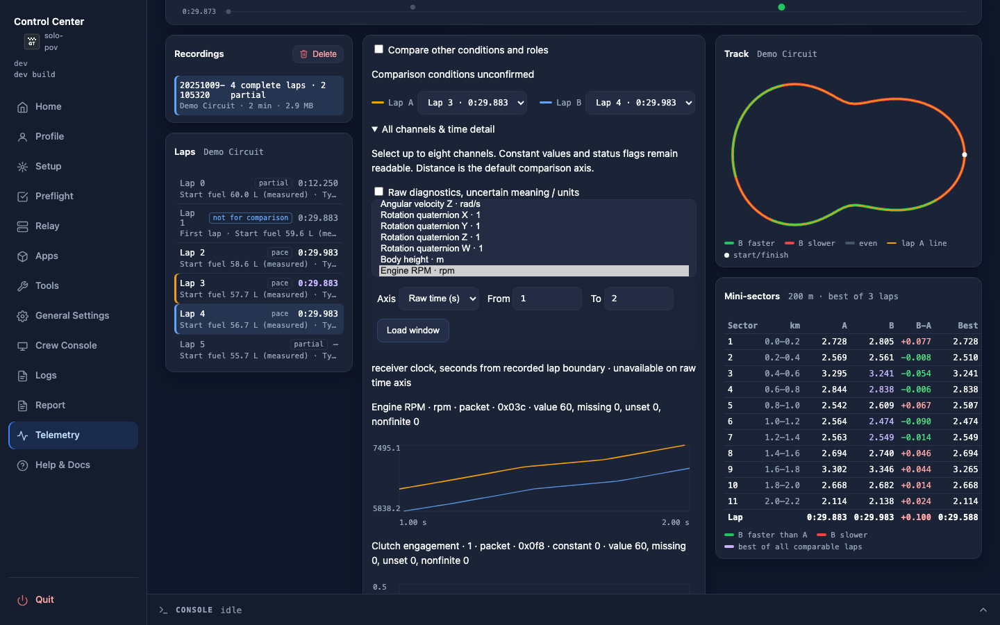

- **Vehicle shift references & observed upshifts.** The selected lap's GT7 car ID resolves
  a local reference. **Update external reference for this car** explicitly downloads
  source curves, ratios and revbar data into machine-local runtime. Ordinary lookup is
  offline and an update failure preserves the previous cache. Unsupported or malformed
  data show unavailable components. External curves and code are not bundled.
- **Acceleration reference.** The independent piecewise-linear calculation compares
  normalized power before and after the adjacent ratio change at equal road speed.
  It assumes full throttle, sufficient grip and instantaneous shifts. Decoded gearbox
  ratios take precedence over stock source ratios. A range-capped target is partial,
  not a confirmed rev limit. Matching ratios do not confirm the power shape for an event.
  Power and torque are each independently normalized to a maximum of 100, not physical
  HP, kW or Nm. The curve endpoint, display alerts, source revbar and separately
  confirmed rev limit have distinct labels. Source commit, SHA-256, fetch date and
  calculation method remain available; the source supplies no per-curve measurement
  date, GT7 revision or fuel-consumption map.
- **Recorded phases.** The table uses original time packets. It infers pre-cut RPM
  from stable drive/cut samples and post RPM from the engaged new-gear bracket.
  The last old-gear packet can already be cut. Capture gaps, skipped gears and neutral
  bridges retain explicit missing/ambiguous phases. Comparisons are for observed
  upshifts; early shifts can be intentional for fuel saving, traction or cornering.
  Acceleration and manually entered stint economy targets have separate neutral RPM
  deviations. A power lookup does not establish an optimum fuel-saving target.
- **Manual event table.** Add an event-specific acceleration table in **Context & notes**,
  or copy locally calculated targets into an unconfirmed event table. Record vehicle,
  intended configuration and provenance, then confirm session and table applicability
  separately. Templates retain the reference while requiring new session confirmation.
  Updates never replace these manual values. Confirming a table does not confirm a
  separately displayed external curve. Reports and CSV exports freeze reference values,
  provenance and phase observations; later updates do not rewrite saved outputs.

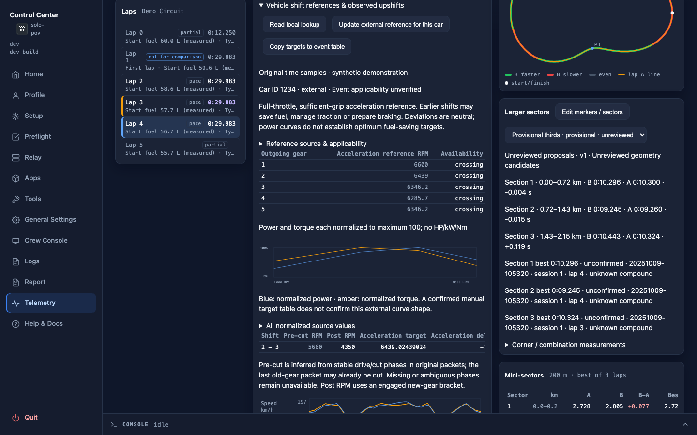

The illustration uses authored synthetic reference values; no external curve is bundled.

- **Track map and mini-sectors.** Lap A is the thin line; lap B is split into 200 m
  mini-sectors, green where B is faster and red where it is slower (the legend under the
  map). The table lists every mini-sector with its distance, the times of A and B, the gap
  and the best time of any comparable lap (purple where B set it); its last row
  adds a diagnostic mini-sector sum. When the comparable laps
  end at different lengths, as on an unknown track, the last mini-sector's best and the
  diagnostic sum show `—`, the same rule as the post-event report.
- **Corners and larger sectors.** Reviewed markers have stable identities and show
  turn numbers on the map. Grand Valley uses the publisher's 19 numbered corners;
  the catalogue's count of 18 stays visible as a different source. Its supplied three
  coaching sections are reviewed divisions, not verified GT7 timing splits. Other
  layouts offer visibly unreviewed geometry proposals. Nominal track length and
  reference-line distance are separate measurements.
- **Edit track markers.** Open the map editor to edit turn number, name, direction
  and entry/anchor/exit world coordinates, or click the map to move the selected
  anchor. Add corners, connected combinations and named sector variants with any
  supported number of boundaries. Changes remain drafts until **Apply shared
  definition**. Definitions are shared across profiles on this machine; overrides
  remain separate from the supplied base. A stale edit requires reloading.
- **Sector definition.** Select a named division for this session. Verified reviewed
  game splits take precedence by default when available; an explicit choice is kept.
  Larger-sector bests show their source recording, session, lap and compound. A
  confirmed ideal composition requires complete eligible timing, reviewed boundaries
  and confirmed comparable conditions. Missing context or provisional divisions show
  an unconfirmed sum. Entry speed across sector boundaries can prevent achieving the
  composed time in one lap. Reports and exports retain the definition/version used;
  later edits do not move spatial notes or rewrite saved outputs.

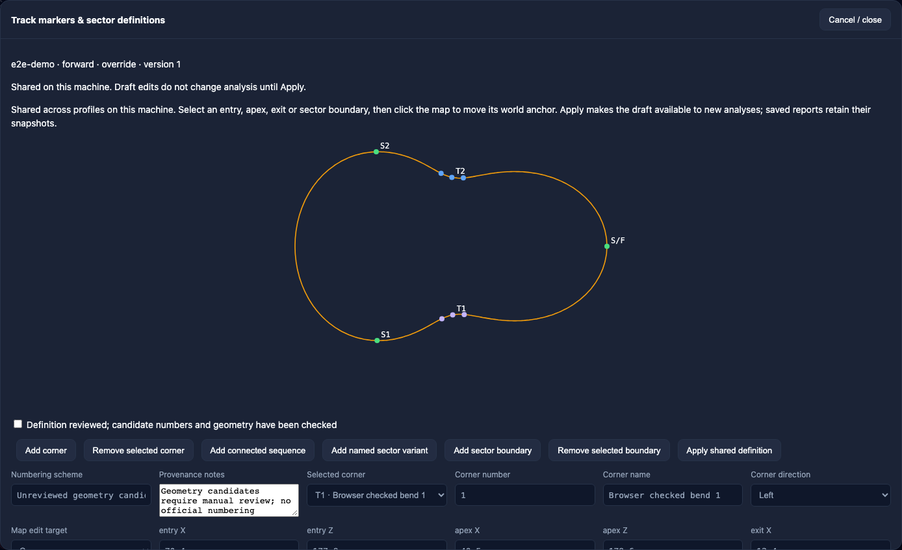
- **Set track.** When racecast does not recognise the layout of a recording, or two
  layouts fit, pick it from the list. racecast assigns the recording to that layout. For
  a layout with a downloaded racing line, or the reverse of one, that is all. For any
  other layout racecast also learns the line from the recording's longest counted lap,
  so later recordings on it are recognised. A downloaded racing line always takes
  precedence over a learned one. The note under the button says which of the two
  happened.

The racing lines are not part of the package. Until racecast has downloaded them
(`racecast gt7-data update`, or the first relay start with telemetry), it recognises
only layouts learned with Set track, and every other recording starts as track unknown.

> **CLI alternative:** `racecast telemetry export <name>` writes laps/channels CSV,
> `sectors.csv`, and current `context.json` and `track-definitions.json` snapshots
> excluding drafts and revision history;
> `racecast telemetry index` builds the missing lap caches ahead of time.

### Help & Docs

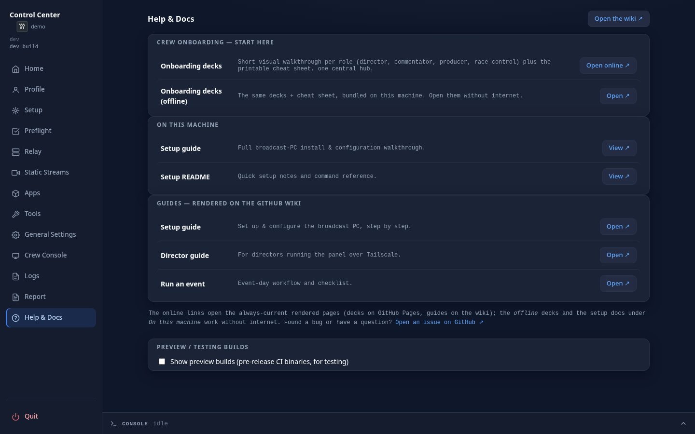

**Start here** opens the visual [onboarding decks](https://jegr78.github.io/gt-racing-broadcast/),
one short walkthrough per role plus the printable cheat sheet, all in one central place.
**On this machine** lists the bundled setup guides (rendered offline, no internet needed),
and the guide links open the always-current pages on this wiki.

## Where to go next

- **Setting up a machine?** → [Set up the broadcast PC](Set-up-the-broadcast-PC)
- **Running a show today?** → [Run an event](Run-an-event)
- **The remote director?** → [Director setup](Director-Setup), then the
  [Director guide](Director)

---

> This page is generated from `src/docs/wiki/` in the
> [main repository](https://github.com/jegr78/gt-racing-broadcast): don't edit it
> here by hand. See [Build & maintenance](Build-and-maintenance).

### Optional AI telemetry analysis

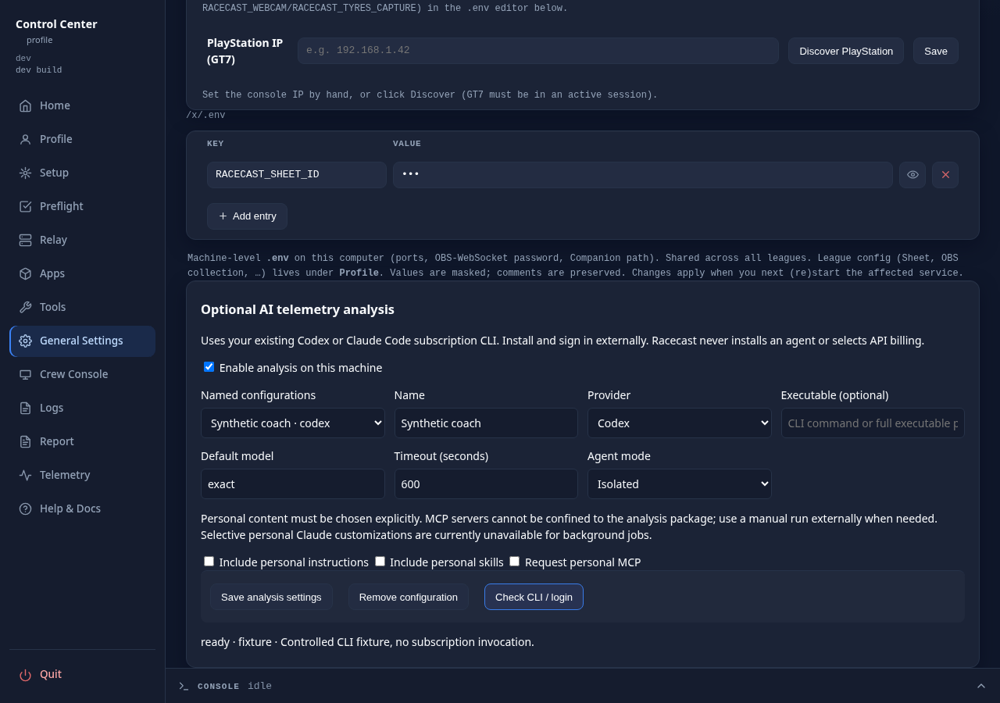

AI analysis is disabled by default. Ordinary telemetry, charts and comparisons work
without either provider CLI. In **General Settings**, enable the feature and save
one or more named Codex or Claude Code configurations. Choose the executable if it
is not on PATH, a default model, timeout and agent mode. **Check CLI / login** probes
the installed tool and existing subscription login without model inference. Model
suggestions depend on the installed CLI; you can enter an exact model name manually.
The same provider can have multiple configurations.

Install and sign in with the provider's own tools before using Racecast:
[Codex authentication](https://developers.openai.com/codex/auth/) and
[Claude Code authentication](https://code.claude.com/docs/en/authentication).
Racecast stores configuration, not provider credentials. It never installs agents,
changes login, silently selects another model or falls back to API billing.
A ready CLI does not guarantee subscription quota or access to a selected model.
On macOS, subscription credentials in the GUI keychain can be unavailable to an
SSH session. Use the authenticated local desktop session for the provider CLI.

**Isolated** is the default mode. The job can read the prepared package and write
its dedicated output, with no blanket approval bypass. **Personal** permits
explicitly selected instructions or skills only where the adapter can preserve
isolation. Personal content may add information beyond the telemetry preview.
Background MCP use is refused because external servers cannot be confined to the
package. Selective Claude customizations currently require a manual external run.
Interactive approval requirements stop the background job with manual-run guidance.

In **Telemetry**, open a recording and choose **Prepare analysis selection**.
Select one completed GT7 session and the completed laps to inspect. Technically
unusable laps show exclusion reasons. Choose **Session overview**, **Driving
technique** or **Consistency**, an agent/model, goals/questions and report language.
Reference suggestions are unchecked until you choose them explicitly. Your own
session best is a valid reference; without an external reference the package does
not establish an ideal line or optimal braking points. Context confirmation, car,
layout, tyres, settings and objective constrain comparisons. Unknown tracks cannot
support cross-recording comparisons.

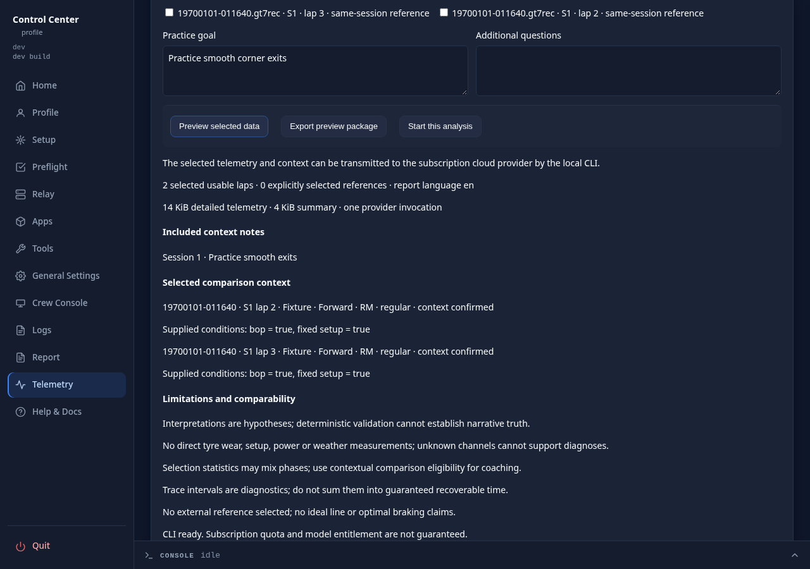

Choose **Preview selected data** to inspect included notes, selected/reference
laps, data sizes and quality/comparability limitations. A local CLI process can send
these selected inputs to the provider's cloud models. Read that disclosure before
**Start this analysis**. Changing the selection, model, context or profile requires
a new preview. An oversized package requires fewer laps/references or shorter notes.
**Export preview package** downloads the four input files without invoking a model.
Stopping a recording never starts analysis automatically.

One job can run on the machine, across the UI and `racecast telemetry analyze`.
The default timeout is ten minutes and is configurable per agent. Progress and
**Cancel active analysis** operate on the spawned process tree. Cancellation cannot
recover quota already consumed. There are no automatic retries or repair calls.
CLI, login, model, quota, approval, timeout and validation failures show guidance.
Choose **Prepare a new run** to deliberately inspect and start another package.

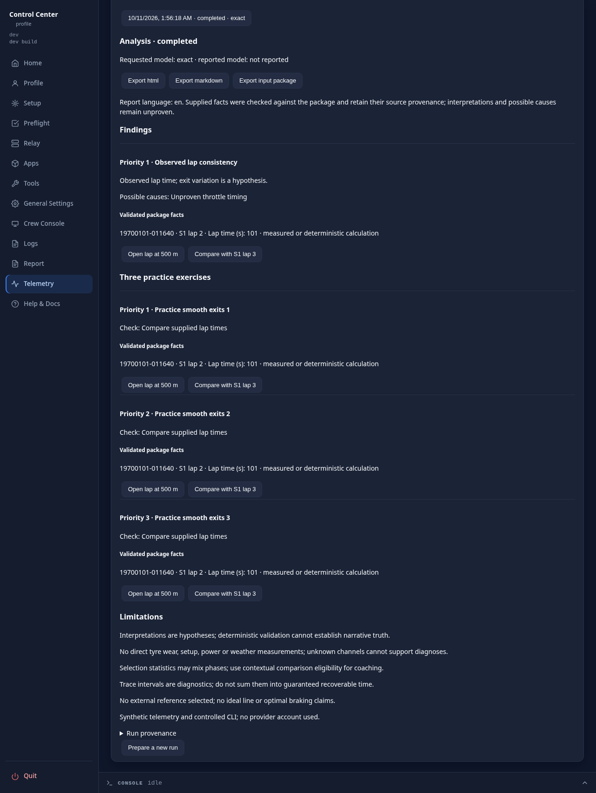

A completed report displays supplied facts with provenance, interpretations and
possible causes as unproven, and three exercises with priorities 1, 2 and 3.
Telemetry links open the referenced lap and metre position in the existing
comparison view. Saved history is scoped to the active profile/recording; switching
profiles clears the displayed selection and artifacts. Relevant source/context or
reference changes mark an old report stale without altering its original inputs.
Failed, cancelled or interrupted jobs retain diagnostics and input packages but
never show a normal report. Each run retains its report language, requested model,
actual model when reported, provider/config identity and versions.

Export a completed report as HTML or Markdown, or export its input package
separately. HTML links require the Control Center at the recorded local address
and the intended profile selected. Recording deletion removes its owned analyses
and input packages after the existing confirmation; machine agent settings remain.
Private recordings and provider credentials are excluded from automated fixtures.
