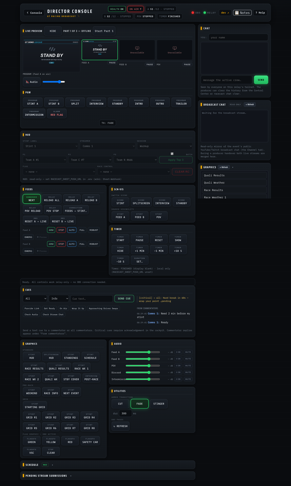
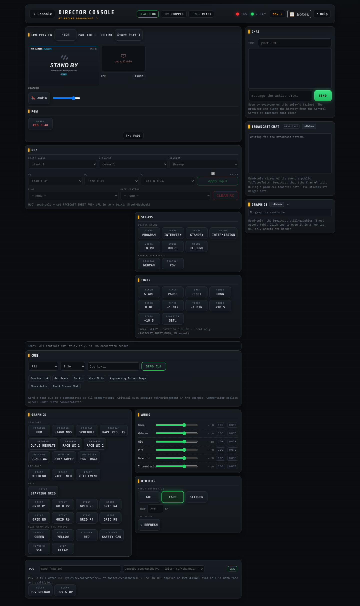
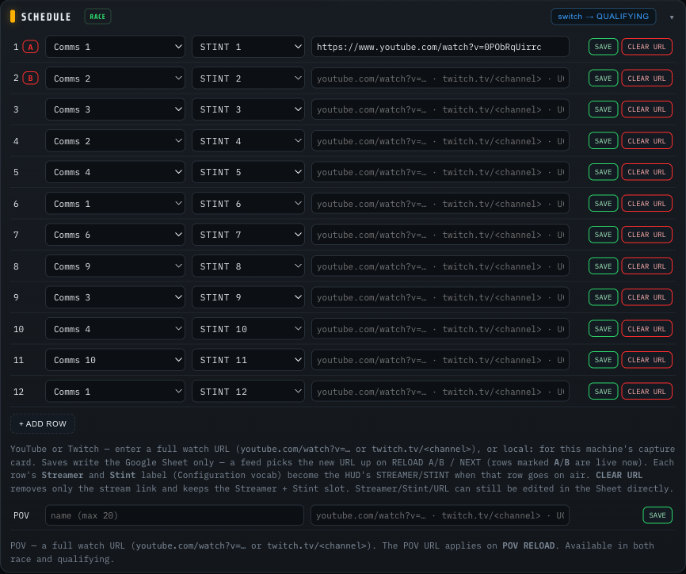

# Director guide

> New here? Start with the visual [Director onboarding deck ↗](https://jegr78.github.io/gt-racing-broadcast/director.html), then come back for the detail below.

You direct the show **from a browser** — no OBS, no software on your machine.
You never touch the producer's PC. Several directors can take turns, and the
producer can also direct locally.

First time? [Director setup](Director-Setup) gets your device connected in
about 5 minutes. From there you have two ways to drive the show:

## Panel or Companion buttons?

Both control the same broadcast. The **director panel** is the primary surface —
one page with every control, plus the Schedule/POV/chat editors, live status and
health warnings; the **Companion buttons** are a hardware-style alternative (the
same layout a Stream Deck uses) for those who prefer large physical buttons. The
practical differences:

| | Director panel (`…:8088/panel`) | Web Buttons (`…:8000/tablet`) |
|---|---|---|
| What it is | one page with everything — program switches, feeds, HUD, graphics, timer, audio — plus live status and health warnings | the big-button board (same layout as a Stream Deck) |
| Needs | nothing beyond the tailnet (or Funnel `/console/panel` link) — no OBS IP, port, or password; the relay talks to the producer's local OBS on your behalf | nothing — the OBS connection lives on the producer's machine |
| Strengths | one-tab overview; shows problems early (banners, feed health); works fully over Funnel | muscle memory; very large touch targets |

## The director panel

**Open it the way the producer set you up:**

- **Standard — the Console link.** Open the personal `/console` link the producer sent
  you, sign in with **Discord** (or your personal sign-in link), and tap the
  **Director Panel** card. This works over the internet with **no Tailscale account, IP
  or password** — see [Director setup](Director-Setup) and [the Console launcher](Console).
- **Fallback — direct on the tailnet.** If you joined the producer's tailnet, open
  `http://<producer-tailscale-ip>:8088/panel` directly.

The page is organized as horizontal busses; the Stream Deck pages and the panel share
one muscle memory:

| Bus | What's on it |
|---|---|
| **PGM** | one-press program looks — `STINT A/B`, `SPLIT`, `INTERVIEW`, `STANDBY`, `INTRO`, `OUTRO`, `TRAILER`, `INTERMISSION`, `RED FLAG` (same behavior as the Companion combos below) |
| **FEEDS** | `NEXT` (the handover), **`ARM A/B` / `STOP A/B`** (arm a feed's pull before a swap / stop it), per-feed reloads, `RESET A/B → LIVE` (reconnect OBS to one feed, see [Dropping a backlog](#dropping-a-backlog)), POV reload/stop, `FEEDS → STINT…` |
| **HUD** | the Stint label, Streamer, Session and Race Control dropdowns — they update the HUD live and write back to the Setup tab |
| **SCN·VIS** | raw scene switches and feed visibility toggles |
| **TRANS** | transition selector for the next scene switch — **Cut**, **Fade** (default), or **Stinger** |
| **GFX** | graphics toggles (HUD, standings, schedule, results, weather, covers) |
| **FLAG GFX** | mutually exclusive flag-status graphic overlays — exactly one active at a time (or none); distinct from the flag-text chip in the HUD |
| **TIMER** | the race timer ([Race Timer](Race-Timer)) |
| **AUDIO** | per-source dB sliders, 0 dB reset and mutes; includes an **Intermission Music** fader for the music track in the Intermission scene |
| **URLs** | collapsible editor for the schedule and POV URLs |

All controls — scenes, sources, audio, feeds, timer, HUD, and URLs — work
relay-only. The relay calls the producer's local OBS on your behalf; no OBS
IP, port, or password is needed in the browser. HUD and URLs additionally need
the sheet-write webhook (see [Sheet-Webhook](Sheet-Webhook)); without it they
are display-only.

### Solo mode

For a **solo** profile (a single-race commentary or driver-POV broadcast — local
capture + webcam, no A/B feeds) the panel adapts automatically: the FEEDS bus,
the A/B feed pills and preview tiles, the stint schedule and the qualifying
editor are hidden, and the POV editor stands on its own card with its own POV
RELOAD / POV STOP. The OBS control busses retarget to the solo scene collection —
SCN·VIS switches `PROGRAM` / `INTERVIEW` / `STANDBY` / `INTERMISSION` / `INTRO` /
`OUTRO` / `DISCORD` and toggles the `WEBCAM` and `POV` picture-in-picture, and the
AUDIO bus exposes the solo mixer: **Game**, **Webcam**, **Mic** (the commentator's
microphone on the producer machine), **POV**, **Discord** and **Intermission**.

> **"Race Control" here is the on-screen HUD banner** (the `RED FLAG`/`Driver Swaps`
> dropdown you set, written to the Setup tab) — **not** the read-only
> [Race Control monitoring desk](Console#race-control-read-only-monitoring-desk) crew
> role. They share a name but never interact: this banner stays director-only, and the
> desk never writes to it.

### Going live — Start/Stop the stream

The **Live Preview** header carries a broadcast button. It shows **OFFLINE** when
OBS is not streaming and turns into **● LIVE HH:MM:SS** (with the running
broadcast time) once on air; while OBS is reconnecting it reads **RECONNECTING…**.
Starting the stream is one click; **stopping asks for confirmation** (ending a live
broadcast mid-event is high-consequence). Like every other control it is
relay-mediated — it drives the producer's local OBS over the same path as the
scene/source/audio controls, so no OBS IP, port, or password is needed in the
browser, and it works over Funnel (`/console/panel`) with only your token. If the
panel cannot reach OBS the button shows **STREAM ?**.

### Status strip and feed health

The strip at the top shows what is on air, the race timer, and one pill per
feed with its stint and state: `A S3 · LIVE` (green — serving), `B S4 · CONN`
(amber — still connecting), `IDLE`, or `STOPPED`. The FEEDS bus adds a health
line per feed, e.g. `A · serving stint 3 (since 1:32:08)`. When a feed has
been connecting for more than ~30 seconds the line turns amber and warns
`stream may not be live yet` — usually the streamer simply hasn't started;
the exact error from the producer's machine is appended when there is one.
The POV feed joins the line while it is connecting or serving.

**BEHIND LIVE** shows how far OBS is behind the live edge of the feeds it plays, worst
feed first (`A 3.1 s`; hover for every feed). It appears once a feed is serving OBS. About 3 s is normal: the relay holds that
reserve on purpose. The pill turns amber when OBS falls more than 5 s behind that,
which means OBS plays the feed slower than real time and the audience sees a growing
delay with stuttering picture and distorted sound. The health pill then names the
feed, e.g. `Feed A output 12 s behind live — OBS reads slower than real time; step the
feed quality down to ROBUST` (POV and a `local:` capture stint have no quality tiers, so
their line says `this source has no quality step-down` instead). A handover clears the delay because the incoming feed
starts fresh; a single-feed session (qualifying, solo) keeps it until the cause is
fixed. Nothing acts on this value automatically.

#### Dropping a backlog

**RESET A → LIVE** / **RESET B → LIVE** (FEEDS bus) makes OBS reconnect to that one
feed. OBS rejoins at the normal ~3 s reserve behind the live edge, so everything it had
fallen behind beyond that is gone at once. The relay never resets a feed because of a
backlog: the only way to shed one is a jump forward, and a jump is a short black dropout
on air. You decide when that trade is worth it.

The button shows the cost before you press it, rounded down: once the reset would throw
away at least a second, a second line appears, e.g. `discards 12 s backlog`. That is the part of the
program the audience will never see. The number follows the live value and can move a
little between polls on a bursty source. After the press the log records what was
discarded. The same button also clears a frozen or stuttering picture on that feed; there
is no separate control for that. A reset does not fix the cause: if OBS still reads slower
than real time, the backlog builds up again.

### Event title

The header subtitle shows the **event title** — a free-text label for this
round, e.g. `GTEC - 2026 - Round 4 - Nürburgring 24h`. It is the same title
shown in the [Commentator Cockpit](Commentator-Cockpit) and on every Discord
message, so the whole crew sees one consistent name. Click the **✎** next to it
to edit it live (Enter saves, Esc cancels); the change applies immediately and
is remembered across a relay restart. The producer can also preset it with
`racecast event start --title "…"` or the league's `EVENT_TITLE` default. It is
**producer-side runtime state** — it is never written to the Google Sheet (see
[Sheet-Webhook](Sheet-Webhook)). Leave it blank and the header keeps its static
text.

### Warning banners

Ongoing problems show as banners directly under the header — they appear
while the condition holds and disappear on their own when it is resolved:

| Banner | Meaning | Who acts |
|---|---|---|
| **RELAY UNREACHABLE** (red) | the panel cannot reach the producer's relay — buttons in FEEDS/TIMER will not work | tell the producer (`racecast status` on their side names the problem) |
| **SHEET SYNC FAILED** (red) | a write to the shared sheet did not go through | tell the producer; re-try the change once the banner clears |
| **TIMER SHEET SYNC FAILED** (red) | the race timer's state is not reaching the sheet — a producer handover would not pick up the correct remaining time | tell the producer; details in [Race Timer](Race-Timer) |
| **COOKIES N H OLD** (amber) | the producer's YouTube cookies are stale — the **next handover may fail** | tell the producer: `racecast cookies firefox` on the producer machine |

One-off action failures (a button press that didn't take) show as short
toasts in the top-right corner and are also logged in the log box at the
bottom.

### Guarded buttons

- `RELOAD A` / `RELOAD B` / `RELOAD ALL` ask for confirmation — a reload
  tears the feed's pull and means a brief interruption if that feed is on
  air.
- `NEXT` locks for 3 seconds after a press, so a double-tap cannot advance
  two stints.

> **Two things are called "stint".** `FEEDS → STINT…` (FEEDS bus) re-targets
> the actual feeds to a stint number — it interrupts running pulls and is for
> corrections/takeovers. **STINT LABEL** (HUD bus) only changes the text
> viewers see on the overlay — harmless. Advancing to the next commentator
> stream is `NEXT`.

### Transition

The **TRANS** bar sets the OBS transition used the next time the panel or a
macro switches the active scene. It is **sticky** — the choice persists across
takes until you change it (a page reload resets it to the default, Fade).

| Choice | Behaviour |
|---|---|
| **Cut** | Instant — no transition effect |
| **Fade** | Cross-fade; the duration field (in ms) controls how long it lasts — **default** |
| **Stinger** | Plays the Stinger transition configured in OBS; falls back to a cut if no Stinger is configured, with a note in the log |

The transition applies to **scene switches** only — buttons on the **PGM** and
**SCN·VIS** busses and the scene-switch step inside macros. It does **not**
apply to **source toggles** (show/hide on the GFX, FLAG GFX, or SCN·VIS rows)
— an OBS-WebSocket limitation.

**Cut and Fade always work.** Stinger requires the producer to have a Stinger
transition configured in OBS (with a media file set in the transition's
settings); if none is present the take falls back to a cut.

## Director panel — HUD row

The **HUD bus** has four dropdowns: **Stint label**, **Streamer**,
**Session**, and **Race Control** (plus a **CLEAR RC** button). The options
come from the Configuration tab of the sheet — any new streamers or messages
added there are picked up automatically without changing the panel.

Each change takes effect on the HUD immediately and is written to the sheet's
Setup tab in the background. An amber outline on the dropdown means the write
is pending; the HUD status line shows the sync state. The panel is the primary
way to set these fields; editing the Setup-tab dropdowns in the sheet directly
is an equivalent fallback when you don't have the panel open.

The panel HUD row needs the sheet-write webhook (the profile's `SHEET_PUSH_URL`);
without it the panel dropdowns are read-only. (The sheet's own dropdowns work
either way — they never need the webhook.) See [Sheet-Webhook](Sheet-Webhook).

## Director panel — Schedule section

Below the main rows the panel has one collapsible, **mode-aware Schedule**
section. Its header carries a mode chip (**RACE** / **QUALIFYING**) and a single
switch button (**switch → QUALIFYING** / **switch → RACE**) — see
[Qualifying](#director-panel--qualifying). The body follows the mode: in **race**
mode it shows the Schedule tab entries (one per stint: **Streamer** + **Stint**
label dropdowns + stream URL; rows currently assigned to a live feed are marked A
or B); in **qualifying** mode it shows the single Qualifying row instead. The
**POV** URL field sits below and is shown in **both** modes (POV is a separate,
mode-independent feed). The Streamer and Stint dropdowns draw from the **same**
Configuration vocabulary as the HUD row dropdowns, so a row's values can never
drift out of vocab.

Saving a change writes it to the sheet — **no feed reconnects
automatically**. A new stream URL takes effect at the next **RELOAD A/B** /
**NEXT** for that feed (POV: **POV RELOAD**). Editing the Schedule tab in the
sheet directly has the same effect and is the fallback when you don't have the
panel open.

**Handover auto-fills the HUD.** When a stint goes on air via **NEXT** (or a
**FEEDS → STINT** takeover), the relay sets the HUD's **Streamer** and **Stint
label** from that Schedule row automatically — no manual HUD-row change per
stint. The HUD-row dropdowns remain available as a live correction; the next
handover re-asserts the schedule's values. A row whose Streamer/Stint is blank
or not in the Configuration vocab simply leaves the HUD field unchanged.

Each row also has a **CLEAR** button: it empties the row's Streamer + Stint +
URL in the sheet (after a confirmation). The row itself stays and can be
refilled later — rows are never deleted, because removing a row would shift the
stint numbering of everything after it.

The Schedule section also needs the profile's `SHEET_PUSH_URL` — without it the fields are
read-only.

## Director panel — Qualifying

Qualifying usually runs on its own day and is a **single stream**. It is handled
by the same [Schedule section](#director-panel--schedule-section) — one mode-aware
block, not a separate one:

- The Schedule header's single **switch → QUALIFYING** / **switch → RACE** button
  switches the relay's *active schedule*. In qualifying mode the relay serves the
  **Qualifying** sheet tab on **Feed A** (Feed B idles — there is only one
  stream), so OBS needs no scene change, and the mode chip turns **QUALIFYING**.
  The switch re-points the feeds (it interrupts a running pull, so it is a
  between-session action, like the FEEDS → STINT takeover, and asks for
  confirmation) and, on switch, the HUD's Streamer + Stint label follow the
  qualifying row — same mechanism as a race handover.
- In qualifying mode the body shows a single editor row (**Streamer** + **Stint**
  dropdowns from the Configuration vocab + stream **URL**) that writes the
  **Qualifying** tab, in place of the race rows. CLEAR empties the row. The POV
  row stays available in both modes.

The relay can also be brought up directly in qualifying mode with
`racecast event start --qualifying` (or `racecast relay start --qualifying`).
Qualifying editing needs the profile's `SHEET_PUSH_URL`; serving and
mode-switching work read-only. If the sheet has no **Qualifying** tab the switch
is hidden and the qualifying controls are disabled. See
[Sheet-Webhook](Sheet-Webhook) for the one-time Apps Script redeploy that enables
qualifying write-back.

## Crew chat

The panel has a collapsible **Crew chat** section — a quick text channel for
everyone connected to the relay over the tailnet (directors, the producer, anyone
on the tailnet whose browser has the panel open). It is separate from Discord and
needs no setup beyond being on the tailnet.

**To use it:** type your name once into the Name field (the browser remembers it),
write a message, and press Enter or **Send**. Messages from all participants appear
in the chat box in order. A badge on the section header counts unread messages while
the section is collapsed — the count is keyed on the server timestamp, so it survives
a producer handover without re-firing.

Messages are visible to everyone whose browser can reach the relay. The relay holds
up to 200 messages in memory and persists them to `runtime/<profile>/chat.json` on
the producer's machine.

**Producer actions** (terminal or Control Center):
- `racecast chat clear` — wipe the history (also available as **Clear chat** in the
  Control Center). There is no HTTP endpoint that clears chat — this is a
  producer-only operation.
- `racecast chat export` — save the current history to `chat-export.json` (or `--out PATH`).
- `racecast chat pull <tailscale-ip>` — fetch another producer's relay history and
  adopt it locally, writing the file and signalling the relay to reload. This works
  at any time, including while the new producer's relay is already running. Use it at
  a producer handover to carry the conversation forward.
- `racecast chat import <file>` — load a previously exported JSON file into the relay.

## Cues

The panel has a collapsible **Cues** section — a director→commentator text-cue channel
(a text-only stand-in for an earpiece). It lets you send a short on-screen message
directly to one or more commentators without leaving the panel.

**Sending a cue:**

1. Pick a **target** from the dropdown:
   - a specific commentator by name (from the Crew/schedule roster),
   - **All commentators** — sent to every commentator's cockpit, or
   - **On air** — the relay resolves this server-side to whoever is currently on the
     live feed at the moment you press Send.
2. Pick a **level**:
   - **Info** — appears as a brief auto-fading toast in the cockpit; expires after 30 s
     with no action needed from the commentator.
   - **Critical** — a large sticky banner that stays up until the commentator clicks
     **Acknowledge**. Once they do, your panel shows a **✓ seen** stamp with the time.
3. Pick or type the cue text. **Presets** (quick-cue buttons) come from the
   `Cue Preset` column in the sheet's **Configuration** tab — managed by the
   sheet admin, picked up automatically, no panel change needed. Free text is
   always available and is the only option when the Configuration tab cannot be
   reached.
4. Press **Send**.

The commentator sees the cue scoped to them (their own name or "all") — they never
see cues addressed to other individuals. The cue panel needs no sheet-write webhook;
it works read-only regardless of `SHEET_PUSH_URL` (presets may be unavailable if
the Configuration tab is unreachable, but free text is always there).

## The Companion Web Buttons board

The same show as big buttons: open the Web Buttons page at
`http://<producer-tailscale-ip>:8000/tablet`. **Three pages** — **show control**
(scenes & feeds), **race timer & audio**, and **flags & graphics**. There is no
on-screen page switch: open all three together at
`http://<producer-tailscale-ip>:8000/tablet?pages=1,2,3` and scroll (or swipe on a
tablet) between them. Everything is a single tap.

### Page 1 — show control

Scenes, feeds and per-feed quality — the live production controls.

| Row | Buttons |
|-----|---------|
| **Combos** | `STINT A`, `STINT B`, `SPLIT`, `INTERVIEW`, `STANDBY`, `INTRO`, `OUTRO`, `TRAILER`, `INTERMISSION`, `RED FLAG` — one press sets a whole look (the scene **and** the right feeds and audio). `SPLIT` shows both feeds side by side, keeps the **on-air** feed's commentator audible and mutes the other feed and Discord. The button names no feed itself: the relay reads which feed is on air and sets the Splitscreen's visibility and audio in one call (`/obs/split`), so this holds whether A or B is live. It also sets **Race Control → *Driver Swaps***; `STINT A` / `STINT B` also end with one relay call (`/obs/stint/A` or `/B`): it shows the picked feed, keeps its audio live and mutes the rest, and on a [local stint](Relay-Mode#local-capture-stint) it opens the producer's commentary mic only when the picked feed is the local one. The Director Panel's STINT A/B make the same call. `STINT A` / `STINT B` **clear Race Control** on the way back — unconditionally, whatever it currently shows — as does the `Feeds Next` handover when it cuts the program back to **Stint**. `INTRO` / `OUTRO` / `TRAILER` cut to the looping intro/outro/trailer clip (with its own audio) and mute the live feeds; they light while on air. `INTERMISSION` cuts to the **Intermission** scene (the full-screen background graphic, looping music track, and read-only broadcast-chat panel) — a pure scene switch that leaves the audio mixer untouched (the feeds aren't in this scene, so their audio stops on its own; nothing to un-mute on the way back); when to use it is up to the team. `RED FLAG` is a toggle: first press shows the Standby Cover in the Stint scene **and** sets Race Control to *Red Flag - Race Suspended*; second press hides the cover and clears Race Control. It lights red while the cover is up |
| **Scenes + relay** | `Stint Scene`, `Split Scene`, `Interview Scene`, `Standby Scene`, `Feeds Next` (the handover), `Feeds Reload` |
| **Feeds & reloads** | `Feed A Toggle`, `Feed B Toggle`, `POV Toggle`, `Feed A Reload` (reconnect only Feed A → `/reload/A`), `Feed B Reload` (→ `/reload/B`), `POV Reload`, `POV Stop` |
| **Feed quality** | `FEED A ROBUST` / `FEED A AUTO`, `FEED B ROBUST` / `FEED B AUTO` — a per-feed **quality profile** for a struggling source: **ROBUST** drops that feed to a sustainable 720p; **AUTO** releases it back to the managed default (full quality, with the relay's automatic step-down re-armed). The sub-720p **Emergency** profile and the per-feed **Preview** stay Director-Panel-only — the deck keeps the two most-used switches. The same control lives on the panel's **Feeds** card |

### Page 2 — race timer & audio

| Row | Buttons |
|-----|---------|
| **Race timer** | `TIMER START` (starts — or resumes a paused timer), `TIMER PAUSE` (freezes the remaining time on screen), `TIMER SHOW` / `TIMER HIDE` (overlay visibility), `TIMER +1 MIN` / `TIMER -1 MIN` (correction: shifts the running countdown, a paused remainder, or — before start — the race duration), `TIMER RESET` (back to the full duration). Stopwatch logic; details in [Race-Timer](Race-Timer) |
| **Mute** | `MUTE A`, `MUTE B`, `MUTE POV`, `MUTE DISC` — each source's `MUTE` and its three `VOL` keys share a colour (Feed A blue, Feed B green, POV amber, Discord violet); a muted source lights **red** |
| **Volume A / B** | `VOL A DOWN` / `VOL A UP` / `VOL A RESET`, `VOL B DOWN` / `VOL B UP` / `VOL B RESET` |
| **Volume POV / Discord** | `VOL POV DOWN` / `VOL POV UP` / `VOL POV RESET`, `VOL DISC DOWN` / `VOL DISC UP` / `VOL DISC RESET` |

> `VOL … UP` / `DOWN` nudge a source by ±3 dB (relative — they drift over a
> session); `VOL … RESET` snaps that source back to **0 dB** (its original
> level). Reset only touches the level, not the mute state — use the `MUTE …`
> buttons for that.

> Tip: for the everyday moves, use the **combo** buttons on page 1 (`STINT A`,
> `SPLIT`, `INTERVIEW`, …) — they set the scene and the audio in one tap.

### Page 3 — flags & graphics

Every graphic overlay in one place: the race-condition flags, the flag graphics,
the pre-race info and starting-grid boards, the standings/results/weather overlays,
and the per-row grid reveals. The flag rows are colour-coded; the overlay toggles
stay dark and light up while their graphic is on air.

| Row | Buttons |
|-----|---------|
| **Flag** | `FLAG GREEN`, `FLAG YELLOW`, `SAFETY CAR`, `FCY` (Full Course Yellow), `RED FLAG`, `CLEAR FLAG` — each sets (or clears) the colour-coded **race-condition flag** HUD element (`/setup/set/flag/<state>`, `CLEAR FLAG` → `/setup/clear/flag`). The flag's vocabulary comes from the sheet's Configuration **Flag** column; these buttons cover the canonical states |
| **Flag Gfx** | `GFX GREEN`, `GFX YELLOW`, `GFX SC`, `GFX VSC`, `GFX RED`, `GFX CLEAR` — toggles a full-screen flag-status **graphic overlay** in the Stint and Splitscreen scenes (`/obs/flag/set/<key>`, `GFX CLEAR` → `/obs/flag/clear`). Exactly one is active at a time; pressing a new one hides the previous. These are the *graphic* alternative to the Flag row above — the two controls are independent |
| **Info + grid** | `Weekend Info`, `Race Info`, `Next Event` — pre-race full-screen Stint graphics, each an independent toggle like Standings — plus `Starting Grid`, the full starting-grid board |
| **Graphics & weather** | `Standings`, `Schedule`, `Race Results`, `Quali Results`, `Standby Toggle` (incident cover — see [The race](#through-the-broadcast-scene--hud-cues)), `Weather Race (1) Toggle`, `Weather Race (2) Toggle`, `Weather Quali Toggle` — the three weather buttons are full-screen Stint overlays, each an independent toggle like Standings/Results |
| **Grid rows** | `Grid R1`…`Grid R8` — reveal individual starting-grid rows over the `Starting Grid` board, each an independent toggle. Each row's PNG paints only its own line, so they layer cleanly in any order |

> The **Flag** row (text chip) is a **separate** element from the page-1 `RED FLAG` combo (which drives the
> Race Control banner + the Standby cover). The race-condition flag text chip is shown
> color-coded in the HUD, is hidden until set, and **persists across stint
> handovers** until you clear it. Same text control is on the panel's **FLAG** dropdown.
>
> The **Flag Gfx** row drives relay-mediated OBS source visibility (`/obs/flag/*`) and
> requires the five optional `Flag …` PNGs from the Sheet **Assets** tab
> (see [Sheet template](Sheet-Template#assets-tab)). A missing PNG is non-fatal — OBS
> shows nothing for that state. The panel's **Flag Gfx** row is the equivalent control.

How the board is imported and built: [Companion](Companion).

## Through the broadcast (scene + HUD cues)

The steps below name the Companion buttons; the panel has the same controls —
the combos sit on the **PGM** bus and **Feeds Next** is **NEXT** in the FEEDS
bus.

As director you drive two things: the **scenes** (Companion or panel) and
three **HUD fields** — **Stint**, **Session**, and **Race Control** — from the
panel's **HUD** bus (Companion carries the same dropdowns; editing the sheet's
Setup tab directly is the fallback). Each is a dropdown: pick the listed value,
or clear it to show nothing. The whole run, in order:

**At go-live (intro)**
- The producer starts streaming on **Standby**. Press **INTRO** to play the looping intro
  clip full-screen (with its own audio). Leave it running until the field is ready, then cut
  into the show (**STINT A** / **Splitscreen** for the formation lap). This is the **Intro
  video scene** — separate from the **Stint → Intro** HUD label below.

**Before the start**
- HUD: **Stint → Intro**, **Session → Warmup**.

**Formation lap** — the race always begins with a manual formation lap.
- HUD: **Race Control → Formation Lap**. Set it **after** the cut: the combos write
  Race Control too (**SPLIT** stamps *Driver Swaps*, **STINT A/B** and the **Feeds Next**
  handover clear it), so a combo or handover afterwards would wipe the *Formation Lap*
  message.
- As the formation lap starts: **Stint → Stint 1**, **Session → Race**.
- Just before the green flag: **clear Race Control**.

**The race**
- Keep the **Stint** scene on the active feed.
- Need to show a weather graphic? Press **Weather Race (1) Toggle**, **Weather Race (2) Toggle** or **Weather Quali Toggle** — each
  drops a full-screen weather overlay onto the Stint scene and is an independent toggle
  (press again to hide), exactly like the Standings/Results graphics.
- At each commentator change, run the [driver-change steps](#at-a-driver-change) below.
- Want a driver's onboard as a small PiP? It needs a **few minutes of lead time** — see
  [Showing a driver POV](#showing-a-driver-pov-plan-ahead) below.
- Incident? Set **Race Control → Red Flag** or **Technical Difficulties** and press
  **Standby Toggle** to hold the picture — it hides the feeds and the POV but keeps the
  Race Control banner and timer visible (the button lights while it's active). When it's
  resolved, press **Standby Toggle** again and **clear Race Control**.
  For a red flag specifically, **RED FLAG** does both in one press (cover + Race
  Control *Red Flag - Race Suspended*); pressing it again ends the phase (cover
  hidden, Race Control cleared). The Race Control write needs the sheet-write
  webhook ([Sheet-Webhook](Sheet-Webhook)) — without it only the cover toggles.
- **Automatic cover on an offline source (#495).** The Standby Cover also raises **on its
  own** when the **on-air** feed's source goes offline, is not live yet, or has ended
  (after a ~12 s settle), so the broadcast shows the standby slate instead of black — the
  HUD (Race Control banner + timer) stays on top. It lowers again automatically once the
  source is live. A `⚠ On-air source offline — Standby Cover auto-raised` note appears in
  the panel's feed-health area; press **RED FLAG** to override (auto never fights a cover
  you raised or lowered by hand). This is the gentler rung below **auto-failover** (which
  switches to Intermission and loses the HUD). Disable only the automation with
  `RACECAST_OBS_AUTO_COVER=0`; the manual button is unaffected.
- **Automatic OBS rebuild and its stand-down (#582).** When OBS stops advancing the
  on-air feed (a frozen or stuttering picture), the relay rebuilds that feed's OBS input on
  its own, like **RESET A → LIVE** / **RESET B → LIVE**. Each rebuild is a short black dropout.
  If three rebuilds in a row leave the picture stalled, the relay stops rebuilding: the
  health pill turns yellow (`Feed A rebuild ineffective — …`, with the frame rate OBS
  renders) and the feed-health area shows `⚠ Feed A · auto-rebuild paused` with a
  **RE-ARM** button. Repeating the rebuild would only add more dropouts; the cause is
  usually the producer machine not keeping up. The automation re-arms by itself at the next
  stint change; **RE-ARM** resumes it immediately. The manual RESET buttons always work.

**Final lap** — once you're in the last stint and the leader starts the final lap:
- HUD: **Race Control → Final Lap**. **Clear it** as soon as the race finishes.

**After the race — interviews**
- HUD: **Stint → Moderator**, **Session → Interviews** — set these **before** you cut.
- Confirm the producer has joined Discord (see [Interviews](#interviews) below), then cut to
  the **Interview** scene.

**Wrap up**
- When the interviews end, cut back to **Stint** and set **Stint → Outro**,
  **Session → Wrapup**.
- For the close, press **OUTRO** — the looping outro clip plays full-screen (with its own
  audio) and stays on air. The producer can then stop streaming at any time. (**OUTRO** is
  the **video scene**; **Stint → Outro** above is the HUD label.)

## At a driver change

Every ~2 hours the commentator changes. You do this from your browser with the
buttons (Companion or panel). Feeds are **armed on demand**: a link in the Schedule
does **not** start pulling until you arm its feed, and **NEXT auto-stops the feed it
cuts away from** — so only one commentator stream is ever pulled at a time (that is
what keeps a cloud/datacenter producer under YouTube's per-IP limit — see *Why arm?*
below).

Per swap:

1. **Enter the next link early** — ~20–30 min ahead, from the panel's **URLs**
   section (or the sheet's Schedule tab as a fallback). It just sits there; nothing
   pulls yet.
2. **Arm the incoming (off-air) feed** a few minutes before the swap: press **ARM A**
   or **ARM B** (FEEDS bus). The relay resolves and pulls it — a cold start of
   ~10–30 s, like POV Reload. Wait until the FEEDS health line shows that feed
   **serving**: that is your "ready to cut" signal. (Arming onto a stream the other
   feed already pulls is refused, so a same-URL back-to-back can never double-pull.)
3. **Cut to Splitscreen** with the **SPLIT** combo (covers the handover window; also
   sets **Race Control → Driver Swaps** for you).
4. **Press NEXT once.** The relay hands over to the armed feed, shows the new
   commentator in the **Stint** scene, switches the audio, cuts the program to
   **Stint**, sets the HUD **Stint** / **Streamer** from the on-air Schedule row,
   clears Race Control — and **stops the outgoing feed's pull**. You do not pick Feed
   A or Feed B; correct the HUD from the panel's **HUD** bus if needed.

Because you armed the incoming feed in step 2, the cut in step 4 is instant. If you
press **NEXT** before that feed is **serving**, nothing is cut and nothing is stopped
— the current program stays on air; arm the feed and press **NEXT** again.

> **Why arm?** On a cloud/datacenter producer, two commentator streams pulled at once
> trip a YouTube per-IP rate-limit within a minute or two (both feeds then stutter).
> Arming just before the cut, plus the auto-stop on NEXT, keeps it to a single pull
> between handovers. **The workflow is identical whether the producer runs in the cloud
> or at home** — one muscle memory, and the director stays in control of the cut. (A
> home/residential line does not hit the per-IP limit, so `RACECAST_MANUAL_FEED_ARM=0`
> exists as a niche escape — a solo operator who wants the old always-pre-warmed
> auto-pull — but it is **not** the recommended path; the standard everywhere is to arm.)

The relay also handles the audio (it mutes the off-air feed, unmutes the on-air one).
**STINT A / STINT B**, **MUTE A / MUTE B** and **Feed A/B Toggle** are a
**break-glass fallback**: if the panel shows **OBS NOT REACHABLE** (the relay
cannot reach OBS on the producer machine), NEXT can't auto-cut — then use
**STINT A / STINT B** (and, if needed, the manual FEED/MUTE buttons) to cut by
hand; `/status` shows which feed is live. The Companion STINT buttons switch the feeds and
their audio directly in OBS before they ask the relay, so they still work here; only the
producer's commentary mic of a local stint is left as it was, because only the relay
switches it.

## Showing a driver POV (plan ahead)

You can show a driver's own stream as a small picture-in-picture (bottom-right) over the
active feed in the **Stint** scene ([how it works](Relay-Mode#driver-pov-pip-optional)).
The one thing to know: **it is not instant.** Between "driver goes live" and "PiP ready
on the producer's machine" the relay still has to resolve and pull the stream — so start
the chain **a few minutes before** you want it on air:

1. **Order it early:** ask the driver to start their (unlisted) live stream and send you
   the watch URL — roughly **5 minutes ahead** is comfortable.
2. **Schedule it:** paste the watch URL into the shared sheet, tab **POV** (row 2) —
   or use the POV row in the panel's **URLs** section, which also has a **name** field
   (free text, ≤20) for the on-screen POV label; one SAVE writes both URL and name.
3. **Pull it:** press **POV Reload**. The relay re-reads the cell and starts pulling.
   Resolving a live stream takes ~10–30 seconds; if the driver is **not live yet**, the
   relay simply keeps retrying every 15 seconds until they are — no harm, but nothing to
   show either.
4. **Verify it's ready:** the panel's FEEDS health line shows the POV state —
   wait until it says **serving**. (Still *connecting* — `CONN` on the strip
   pill — means it's resolving or the driver isn't live yet: don't show it;
   the PiP would be black.) No panel open?
   `http://<producer-tailscale-ip>:8088/status` shows the same: the `pov`
   block must say `"state": "serving"`.
5. **Show it:** press **POV Toggle** — a relay action (panel and Companion both call the
   relay, not OBS directly): the relay shows/hides the PiP in OBS and the whole HUD POV
   box (frame + name) follows it. Allow a couple of seconds for OBS to connect the first
   time. Audio is muted by default; **MUTE POV** / **VOL POV …** (page 2) if you want it
   audible.
6. **Done:** **POV Toggle** to hide, then **POV Stop** (frees the pull / bandwidth).

Two rules: **Reload before Toggle**, and **hide + POV Stop when done**. The PiP lives only
in the Stint scene — switching to Splitscreen/Interview/Standby auto-hides and
auto-silences it.

## Interviews

Interviews are over Discord voice. **Before** you cut to the Interview scene, confirm the
**producer has joined the Discord "Interviews" voice channel** — the audio comes from the
producer's local machine, so you can't join for them. Then switch to **Interview**, show
the lower-third, and manage mutes as guests speak. The conversation itself is moderated
from inside the voice channel by one of its participants — usually the final-stint
streamer. You can take that role, but it isn't yours by default: your job is the scene
and the broadcast audio.

---

New to the team? → [Who does what](Who-does-what). Something off? →
[If something goes wrong](If-something-goes-wrong).
