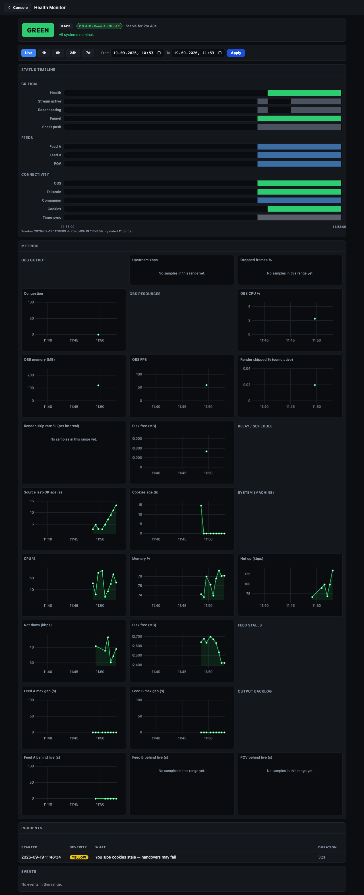

# Health Monitor



The **Health Monitor** is a read-only dashboard served by the relay that lets any
authenticated crew member see how the relay has been performing: live and over time.
It is a passive observer: it never changes what is on air or pings Discord.

## How to open it

**From the `/console` launcher**, the recommended path. Any crew member who has
signed in to the [Console](Console) launcher sees a **Health Monitor** card; clicking
it opens `/console/health-monitor` over the Funnel (public HTTPS) or the tailnet,
depending on how you reached the Console. No extra password or role is required, the
same token that opens your cockpit or the director panel also opens the Health Monitor.

**Direct tailnet access**, on the tailnet, `http://<tailscale-ip>:8088/health-monitor`
also works. The page is not exposed publicly on its own; only `/console` (including
`/console/health-monitor`) is Funnel-mounted.

> **Access level:** any authenticated `/console` subject: commentators, directors,
> Race Control, producers: can open it. It is read-only and triggers no broadcast
> actions.

## What the dashboard shows

### Aggregate health badge

A large green / yellow / red badge at the top of the page reflects the relay's
**current aggregate health**. Below it, any active reasons (e.g. "Feed A stalled",
"cookies expiring soon") appear as a short list.

### Status-band timelines

Horizontal bands show the health history for each subsystem across the selected
time range. Each band is coloured green / yellow / red per sample period.

The bands are grouped into three sections:

#### Critical

These bands can drive the aggregate health level to red. A problem here is always
visible to the whole crew through the aggregate badge.

| Band | What it tracks |
|---|---|
| **Health** | Aggregate relay health (the badge above, over time) |
| **Stream active** | Whether OBS is actively streaming to the broadcast platform. Red (and alerting) only once OBS has streamed at least once this session and then stops, so a live broadcast dropping off air pages, but starting the relay before you go live does not. |
| **Reconnecting** | Whether the OBS output is in a reconnect loop. Yellow when reconnecting. |
| **Funnel** | Whether Tailscale Funnel is up (required for `/console` to be reachable publicly). Red when expected but down. |
| **Sheet push** | Whether the relay's last write to the Google Sheet webhook succeeded. Yellow on repeated failure. |

#### Feeds

| Band | What it tracks |
|---|---|
| **Feed A** | Whether Feed A was streaming or stalled |
| **Feed B** | Whether Feed B was streaming or stalled |
| **POV** | Whether the POV feed was active |

#### Connectivity

These are **observational**, a problem here turns yellow and is noted, but it does not
necessarily drive the aggregate to red on its own.

| Band | What it tracks |
|---|---|
| **OBS** | Whether the relay could reach OBS via obs-websocket |
| **Tailscale** | Whether this machine's Tailscale node is up |
| **Companion** | Whether Bitfocus Companion is reachable on its control port |
| **Cookies** | YouTube-cookie freshness (approaching expiry = yellow; expired = red) |
| **Timer sync** | Whether the race-timer push to the Sheet is succeeding |

> **Critical vs. observational:** Critical bands (`stream_active`, `funnel_ok`,
> `sheet_push_ok`, `stream_reconnecting`) contribute to the aggregate health level when
> they fault. Connectivity bands (`tailscale_up`, `companion_ok`, `obs_reachable`) are
> informational: they record what happened without necessarily escalating the aggregate.
>
> **Off-air alarm latches on the first stream:** the off-air CRITICAL only fires after
> OBS has gone live at least once this relay session and *then* stops streaming, so a
> live broadcast that drops off air pages the crew, while simply starting the relay
> before the show never sends a confusing pre-show ping. (The **Stream active** band
> itself still shows the honest current state; it is the aggregate health + Discord
> alert that wait for the latch.)

### Numeric line charts

Line charts plot scalar metrics over time, grouped by subsystem:

#### OBS Output

| Chart | What it tracks |
|---|---|
| **Upstream kbps** | Outgoing stream bitrate reported by OBS |
| **Dropped frames %** | Percentage of frames dropped by the OBS encoder or network |
| **Congestion** | OBS output congestion score (0–1; higher = more back-pressure) |

#### OBS Resources

| Chart | What it tracks |
|---|---|
| **OBS CPU %** | CPU usage of the OBS process |
| **OBS memory (MB)** | OBS process resident memory in megabytes |
| **OBS FPS** | Rendered frames per second reported by OBS |
| **Render skipped %** | Percentage of frames skipped by the OBS renderer |
| **Disk free (MB)** | Free disk space on the OBS recording drive |

#### System (machine)

| Chart | What it tracks |
|---|---|
| **CPU %** | Producer machine CPU utilisation |
| **Memory %** | Producer machine RAM utilisation |
| **Net up (kbps)** | Upload throughput in kilobits per second |
| **Net down (kbps)** | Download throughput in kilobits per second |
| **Disk free (MB)** | Free disk space on the machine's primary drive |

These metrics are sampled every ~30 s in the relay heartbeat alongside the
[OBS Resources](#obs-resources) series. History recorded before this feature was
added will show no data points for this group, that is expected.

#### Output backlog

| Chart | What it tracks |
|---|---|
| **Feed A / Feed B / POV behind live (s)** | How far OBS is behind the live edge of that feed, as the smallest value of each ~30 s interval |

The relay holds OBS about 3 s behind the live edge on purpose (the fan-out reserve,
`RACECAST_FEED_PREBUFFER_S`), so a flat line near 3 s is healthy; a bursty source can
also sit lower. A line that climbs means OBS accepts the feed slower than real time,
usually because the producer machine cannot render the program in real time. More
than 5 s above the reserve turns the health badge yellow
(`Feed A output 12 s behind live: …`); this yellow never posts to Discord. The director
can drop the delay with **RESET A → LIVE**, at the cost of a short black dropout (see
[Dropping a backlog](Director#dropping-a-backlog)).

#### Legacy series (always present)

| Chart | What it tracks |
|---|---|
| **Sheet source age** | Seconds since the schedule/overlay sheet was last successfully read |
| **Cookie age** | Age of the YouTube cookies file in seconds |

> **Synthetic / no-OBS mode:** when OBS is not reachable (obs-websocket unavailable),
> the OBS Output and OBS Resources series are empty. The charts render but show no data
> points, that is correct and expected before an event when OBS is not yet open.

### Incident timeline

Below the charts, a list of **incidents**: moments when the aggregate health dropped
to yellow or red, with a start time, end time (or "ongoing"), duration, and the
reasons that were active. Each incident is a single row; open it for the full
reason list at that moment.

### Events

Below the incidents, an **Events** list records discrete moments, not health-level
changes, but notable actions: with the time, an event badge, a short detail, and the
**producer** (which host/operator triggered it). Each event is also drawn as a thin
dashed vertical line across the numeric charts, so you can line a takeover or a stream
start/stop up against the metrics.

| Event | When it fires |
|---|---|
| **Takeover** | Another producer took over the broadcast (`racecast event takeover`). The detail names the incoming and outgoing producer; the producer column is the new (incoming) host. |
| **Stream start** | OBS started streaming to the broadcast platform. |
| **Stream stop** | OBS stopped streaming (the broadcast went off air). |

The same three events are also pushed to the league's **Discord** webhook (if
configured): a takeover and a stream stop carry an `@here` ping; a stream start is a
quiet informational post. Every post footer names the producer, so the crew can see at
a glance which host raised it. Events ride along with the health history on
[producer handover](#export-import-and-producer-handover), so the incoming producer's
monitor shows the takeover marker too.

## Time-range controls

Preset buttons at the top of the page select the window to display:

| Control | Window |
|---|---|
| **Live** | The most recent ~5 minutes, auto-refreshing |
| **1h** | Last 1 hour |
| **6h** | Last 6 hours |
| **24h** | Last 24 hours |
| **7d** | Last 7 days |
| **Custom** | A from–to date-time picker |

The page does not auto-refresh outside Live mode; hit the browser refresh to update a
historical view.

## Persistence and retention

The relay samples its own health every ~30 seconds into a per-profile SQLite database
at `runtime/<profile>/health-history.db`. Samples are retained for **30 days** by
default; set `RACECAST_HEALTH_RETENTION_DAYS` in your `.env` to a different number.
The history belongs to the active profile: switching profiles shows the new profile's
own history.

## Export, import, and producer handover

History can be moved between machines as a [JSON Lines](https://jsonlines.org/) file:

```
racecast health export [--from TS] [--out PATH]   # dump history to a .jsonl file
racecast health import <file.jsonl>               # merge a dump into the local DB (dedup by ts)
racecast health pull <ip> [--port N] [--from TS]  # pull another producer's history over the tailnet
```

During `racecast event takeover`, health history is pulled automatically from the
outgoing producer: the same pattern as `chat pull` and `console pull-versions`. The
`--funnel` takeover path also carries health over the step-up-authenticated
`/console/takeover/health` endpoint.

## Setup

No setup is required. The Health Monitor is active whenever the relay is running,
there is no enable/disable command. The SQLite database is created automatically on
the first relay start.

## Post-Event Report

The relay's health history also powers a **post-event report**, a static, self-contained
HTML file summarising the last broadcast session: commentators per stint, Feed A / Feed B
activity, incidents and quality metrics. It can be generated and sent to Discord from the
[Control Center Report view](Control-Center#post-event-report) or via the CLI:

```
racecast report               # generate the report for the last session into runtime/<profile>/reports/
racecast report send [FILE]   # send the newest (or given) report to the league Discord as an attachment
```

**The finding.** The report opens with one verdict line, before any table. It leads with
what the audience saw, then gives the reason:

- *Output ran behind live for 41m 0s of 56m 0s on air, peak 19.0 s.* The time the **on-air**
  feed spent behind live by the same rule that turns the health badge yellow (more than
  `RACECAST_FEED_BACKLOG_WARN_S` beyond the `RACECAST_FEED_PREBUFFER_S` reserve, both read
  from the machine `.env`), and the worst value. Each value is the smallest backlog of its
  ~30 s interval, so the peak is a lower bound. A backlog on the off-air feed does not
  count: nobody is watching it.
- The next line explains it with the frame rate: *OBS rendered 45.8 of the configured 60 fps
  and skipped 23.5% of its frames.* The configured rate comes from OBS's video settings; a
  broadcast average more than 2% below it is flagged.
- A backlog clears at every stint handover, so the report states how many handovers the
  session had. A session without one (qualifying, solo) lets a backlog grow for its whole
  length.

A history recorded before the relay measured the backlog gets a frame-rate-only finding.
**Render skipped** in the quality table is the per-interval rate over the on-air time.
OBS's own counter runs from the moment OBS started, so hours of idle OBS before a
broadcast would hide a bad one (1.8% shown for a broadcast that skipped 23.5%).

**Name resolution:** commentator names in the report come from the running relay's schedule.
If the relay is not running at generation time, the report falls back to stint indices.

**Discord:** `report send` requires `DISCORD_WEBHOOK_URL` in the active league's `profile.env`,
the same key that health alerts use. See [Configuration](Configuration) or [Profiles](Profiles)
for how to add it.

The dashboard depends on no external services: it reads only from the local DB and the
relay's live `/health-monitor/data` endpoint. The charting library
([uPlot](https://github.com/leeoniya/uPlot), MIT licence) is bundled with the relay
(`src/assets/vendor/uplot/`): no internet connection is needed to render the charts.

---

> This page is generated from `src/docs/wiki/` in the
> [main repository](https://github.com/jegr78/gt-racing-broadcast): don't edit it
> here by hand. See [Build & maintenance](Build-and-maintenance).
