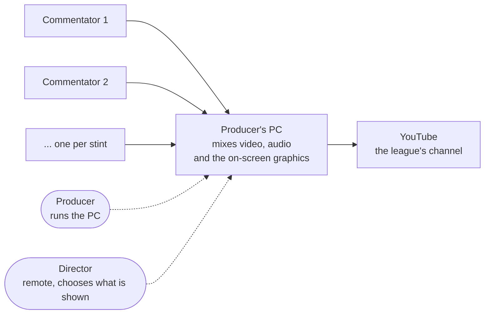

# GT Racing Broadcast

This wiki is for everyone who runs the **GT Racing** sim-racing broadcast: whether
you set up the machine, run the show, or direct it remotely.

**In one picture:** each stint has a commentator streaming the race on their own YouTube
or Twitch channel. One PC pulls those streams in, adds the on-screen graphics and the
Discord interview audio, and pushes a single, clean broadcast to the league's YouTube channel. A
**Producer** runs that PC; a **Director** decides what viewers see: from a browser,
anywhere. One machine can serve several leagues, each is a [**profile**](Profiles) with its own
sheet, graphics and [overlay look](HUD-Overlays).

- **Get the tool:** download the release for your OS from the
  [latest release](https://github.com/jegr78/gt-racing-broadcast/releases/latest),
  extract it, and double-click **`racecast-ui`** to open the
  [Control Center](Control-Center): the web app that runs the whole station from
  your browser. Then follow [Set up the broadcast PC](Set-up-the-broadcast-PC).
  (Prefer a terminal? Everything is also a `racecast …` command.)

## Pick your path

- **What is the Control Center?** → [The Control Center](Control-Center)
- **Setting up a machine for the first time?** → [Set up the broadcast PC](Set-up-the-broadcast-PC)
  (on Arch, read [this supplement](Arch-Linux) alongside it: worked through on CachyOS)
- **Running a show today?** → [Run an event](Run-an-event)
- **Producing from a cloud GPU box?** → [Remote producer (cloud GPU box)](Cloud-Producer)
- **You're the remote director?** → [Director setup](Director-Setup) (first
  time), then the [Director guide](Director)
- **You run the league (Sheet + Discord)?** → [League owner setup](League-Owner-Setup)
- **Watching read-only as Race Control?** → [Console → Race Control desk](Console#race-control-read-only-monitoring-desk)
- **Helping over the internet without a Tailscale account?** → [Remote access & the Funnel](Remote-access)
- **Not sure who does what?** → [Who does what](Who-does-what)
- **New crew?** The [onboarding decks ↗](https://jegr78.github.io/gt-racing-broadcast/) are short visual walkthroughs per role.
- **Something's broken?** → [If something goes wrong](If-something-goes-wrong)
- **Developer / want the technical detail?** → [Architecture](Architecture) and the
  **Technical reference** section in the sidebar.

## The words we use

| Term | Meaning |
|---|---|
| **The relay** | the small server on the producer's PC that pulls each commentator's YouTube or Twitch stream and hands it to OBS, [Relay, how the feeds work](Relay-Mode) |
| **Feed A / Feed B** | the two fixed slots the relay serves; they take turns so the picture never drops at a driver change. [Relay-Mode](Relay-Mode) |
| **Stint** | one commentator's stretch of the race; the schedule is a numbered list of stints. [Run an event](Run-an-event) |
| **NEXT / handover** | the driver-change moment: the off-air feed advances to the next stint's stream. [Director guide](Director) |
| **HUD** | the on-screen overlay (drivers, teams, session info) the relay serves to OBS. [OBS & scenes](OBS-Setup) |
| **Race timer** | the on-screen countdown, controlled by the director. [Race Timer](Race-Timer) |
| **The panel** | the director's browser page at `:8088/panel`, every control of the show on one page, [Director guide](Director) |
| **Companion** | Bitfocus Companion, the big-buttons board (browser or Stream Deck), the panel's sibling. [Companion](Companion) |
| **Tailscale** | the private-network app that makes the producer's PC reachable for remote directors. [Director setup](Director-Setup) |
| **Funnel** | Tailscale's public ingress; the producer can publish **only** the role-gated `/console` crew page on it, so commentators/directors can help with no Tailscale account. [Remote access & the Funnel](Remote-access) |
| **/console** | the single role-adaptive crew link: one per person; shows the cockpit, the panel and/or takeover per the person's roles, [Remote access](Remote-access) |
| **The Sheet** | the shared Google Sheet that drives the schedule, the HUD and the downloadable assets. [Configuration & secrets](Configuration) |
| **Cookies** | the exported YouTube login the relay needs to pass YouTube's bot check (required); optionally also Twitch for gated feeds. [Relay-Mode](Relay-Mode) |
| **Preflight** | `racecast preflight`, the machine check that names the exact fix for anything missing. [Set up the broadcast PC](Set-up-the-broadcast-PC) |
| **POV** | the optional driver picture-in-picture feed. [Director guide](Director) |

---

> This wiki is generated from `src/docs/wiki/` in the
> [main repository](https://github.com/jegr78/gt-racing-broadcast): don't edit pages
> here by hand. See [Build & maintenance](Build-and-maintenance).
