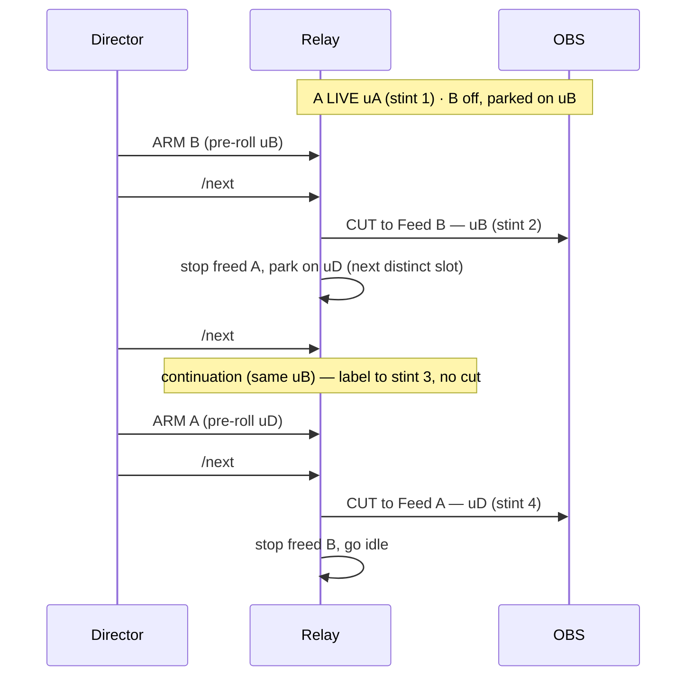
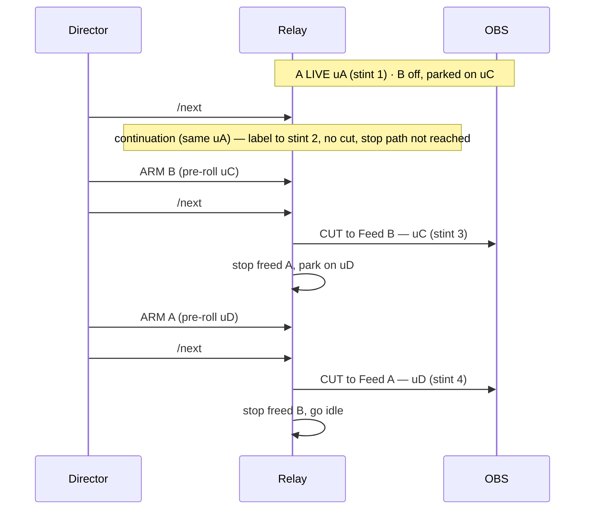

# Relay Mode

> Technical reference. The operator version is [Run an event](Run-an-event).

The recommended flow for endurance racing: **one commentator per stint**, streams
**unlisted**, two fixed feeds that "walk" along the schedule. See
[Architecture §2](Architecture#2-relay-ping-pong-the-endurance-flow) for the diagram.

## How it pulls (important)

The relay supports **YouTube and Twitch** feeds (YouTube via yt-dlp, Twitch direct via Streamlink).

**YouTube feeds:** the relay uses **yt-dlp to resolve** each live HLS URL — this is what
passes YouTube's bot-check, via `yt-cookies.txt` + deno JS-challenge solving — and
**streamlink to serve** that direct URL to OBS. So `yt-cookies.txt` and `deno` are both
required for reliable YouTube pulls. Streamlink alone, even with cookies, is blocked by
the bot-check.

**Twitch feeds:** the relay routes those directly through Streamlink's native Twitch
plugin (no yt-dlp hop). Low-latency mode is enabled automatically; ad filtering is
handled by Streamlink's current built-in behavior. Public Twitch channels need no
cookies; gated (subscriber/follower-only) channels need `twitch-cookies.txt`
(see [§2 below](#2-producer-accounts-and-cookies-before-each-event)).

A running feed is **never** torn off mid-stint. Sheet edits apply on the next `/next`
(handover) or `/reload`. Curling a feed port returns nothing — each port serves a single
consumer (OBS); that is not a failure.

## 1. The schedule (Google Sheet tab `Schedule`)

- One column holds the entries **in stint order**; other columns (stint number / name)
  are ignored. Editable remotely by anyone with sheet access.
- **Enter full watch URLs** for each stint:
  - YouTube: `https://www.youtube.com/watch?v=VIDEOID` — **unlisted streams must use
    this form**; the channel `/live` URL only works for public streams. A bare
    `UC…` channel ID is also accepted as a shorthand for YouTube streams.
  - Twitch: `https://www.twitch.tv/<channel>` — there is no bare-ID short form for Twitch.
  - `local:` — the stint comes from a capture card on the producer machine, not from a
    stream. See [Local capture stint](#local-capture-stint).
- The streamer/director enters their watch URL shortly before their stint.
- Default sheet = the shared HUD sheet (the active profile's `SHEET_ID`). Override with
  `--sheet-id …` / `--sheet-tab …`.

## 2. Producer accounts and cookies (before each event)

### YouTube login (required)

Against YouTube's *"Sign in to confirm you're not a bot"*. Easiest — auto-export from
your **logged-in** browser:

```bash
racecast cookies firefox
# browsers: firefox | chrome | safari | edge | brave   (Firefox recommended)
```

- You must be **logged into YouTube** in that browser.
- **Firefox is the recommended source on every OS** — no prompts, and it works even
  while Firefox is running.
- **Windows**: Chrome/Edge/Brave **cannot** be exported — their cookies are app-bound
  encrypted (Chrome 127+); use Firefox.
- macOS **Chrome/Edge**: approve the Keychain prompt. **Safari**: grant your terminal
  **Full Disk Access**. (Firefox needs neither.)
- Writes `runtime/yt-cookies.txt` (chmod 600), auto-detected and passed to yt-dlp.
  `/status` then shows `"cookies": true`. **Re-run before each event** — cookies rotate.
- The export keeps only the `youtube.com` cookies. The browser's other sessions
  (Google account, GitHub, Discord, …) are dropped, and the command prints how many.
  A jar you drop in by hand is used as it is.
- Alternative: let the relay export on start with `--cookies-from-browser firefox`, or
  drop any Netscape `yt-cookies.txt` next to the relay (a legacy `cookies.txt` is
  migrated automatically on first use).

### Twitch login (optional)

Only needed for **gated** (subscriber/follower-only) Twitch streams. Public Twitch
channels work without any cookies. If any stint uses a gated Twitch feed, export the
producer's Twitch session before the event:

```bash
racecast cookies twitch firefox
# browsers: firefox | chrome | safari | edge | brave   (Firefox recommended)
```

- You must be **logged into Twitch** in that browser (not YouTube — a separate session).
- Writes `runtime/twitch-cookies.txt` (chmod 600), auto-detected by the relay for
  Twitch feeds. Only the `twitch.tv` cookies are kept. The `/status` `cookies` field shows whether the YouTube cookie jar is loaded.
- **Re-run before each event** alongside the YouTube refresh.

### Summary: which accounts the producer needs

| Account | When needed | Cookie file |
|---|---|---|
| **YouTube** (logged in) | Always — needed for the bot-check on any YouTube feed | `yt-cookies.txt` |
| **Twitch** (logged in) | Only if any stint uses a gated (sub/follower-only) Twitch feed | `twitch-cookies.txt` |

The cookies are shared across all leagues on the machine and live at the top-level
`runtime/` directory (not per-profile).

### Known limits

- **YouTube server-side ads (DAI/SSAI):** if the streamer's channel serves server-side
  inserted ads, the relay detects the ad marker in the stream and reports it in
  `/status` (surfaced as the feed's `last_error` in `/status`, and shown on the director panel).
  The relay cannot remove them — there is no reliable skip mechanism. The clean solution
  is an ad-free source: league-owned, unlisted, unmonetized stint streams have no server-side ads.
- **Twitch ad filtering:** handled automatically by Streamlink's current built-in
  behavior. Coverage depends on Streamlink's version and Twitch's current serving
  method.
- **Twitch URL form:** always use the full `twitch.tv/<channel>` URL in the schedule.
  There is no bare-ID short form for Twitch (unlike YouTube's bare `UC…` channel ID).

## 3. Start the relay

```bash
racecast relay start        # background
racecast relay run          # foreground/debug mode
```

Stop with `racecast relay stop` (or Ctrl+C in foreground mode). For remote
directors, bind the control server to the producer's **Tailscale IP** (not `0.0.0.0`) —
see [Director](Director) and the security note below.
(Developers running from the repo: python3 src/racecast.py works the same everywhere.)

**Taking over mid-event (multi-part broadcasts):** start the relay at the stint
that is on air right now —

```bash
racecast relay start --stint 4   # stint 4 is live: Feed A serves it, Feed B preloads stint 5
```

`--stint` puts that stint on Feed A and preloads the next one on Feed B — there
is no need to continue the previous producer's A/B order; `/next` works as
usual from there. Full checklist:
[Run an event → Producer handover](Run-an-event#producer-handover-12h24h-multi-part-events).

> With manual feed-arm (**the default**), "preloads" means Feed B's index is *positioned*
> on the next stint — it does **not** pull until you **arm** it before the swap, and
> `/next` auto-stops the outgoing feed after it cuts (the single-puller flow — see
> [At a driver change](Director#at-a-driver-change)). Set `RACECAST_MANUAL_FEED_ARM=0`
> to restore immediate pre-warm pulling (home producers on a residential IP).

## 4. Control it (Companion → relay)

Companion connection **"Generic HTTP Requests"**, action **GET**:

| Button | Endpoint | When |
|--------|----------|------|
| **Feeds Next** | `http://127.0.0.1:8088/next` | once per handover, right after cutting to the new feed |
| **Feeds Reload** | `http://127.0.0.1:8088/reload` | edited a cell in the sheet → reload the current feed now |
| **Feed A Reload** | `http://127.0.0.1:8088/reload/A` | reconnect only Feed A (one feed glitched mid-stint) |
| **Feed B Reload** | `http://127.0.0.1:8088/reload/B` | reconnect only Feed B |

**Feeds Next (`/next`)** now also drives OBS over obs-websocket: it makes the new
commentator visible in the **Stint** scene, switches the feed audio, and cuts the
program to **Stint** (only once the incoming feed is actually serving — never to a
black/buffering feed). No Feed A/B choice and no special case for starting with one
link. Requires obs-websocket reachable (see Pre-flight); otherwise the manual
panel/Companion FEED + scene buttons remain the fallback.

Works for remote directors too — Companion makes the request locally on the producer
station.

One more endpoint for the browser (not a Companion button — it needs a number):
`http://127.0.0.1:8088/set/stint/<n>` positions BOTH feeds for a producer
takeover (1-based: stint n on Feed A, n+1 preloaded on Feed B). It tears
running feeds — use it before going live, never mid-program.

---

## Same-URL back-to-back stints

When one commentator keeps **a single stream across several consecutive stints**, those
Schedule rows carry the **same URL**. The relay treats a run of consecutive same-URL rows
as **one slot = one feed pull**: the stream is pulled once, and the on-screen **stint
label** advances on each `/next` with **no re-pull and no program cut**. The off-air feed
always skips a same-URL run and parks on the next *distinct* slot, so two feeds never pull
the identical stream — the single-puller rule that keeps a cloud producer under YouTube's
per-IP limit (see [Why arm?](Director#at-a-driver-change)).

So `/next` decides per press:

- **Continuation** — the next row repeats the on-air URL → **label only**: the displayed
  stint advances; nothing is armed, stopped or cut.
- **Real handover** — the next row is a new URL → the pre-armed off-air feed is cut in,
  and the outgoing feed is auto-stopped and advanced past the run to the next distinct slot.

In the tables below, `LIVE` = on air + pulling · `off`/`STOP` = disarmed (no pull) ·
`idle` = parked past the schedule end · `idxN` = the feed's pull row (0-based).

### Scenario A — back-to-back in the middle

Stint 1 = commentator **K1** (`uA`) · **stints 2 + 3 = commentator K2 on one stream
(`uB`)** · stint 4 = **K4** (`uD`) → slots `[0, 1, 1, 2]`.



| Step | Director | `/next` does | Feed A | Feed B | On screen | Cut |
|---|---|---|---|---|---|---|
| 0 | Start (both disarmed) | — | idx0 off | idx1 off | Stint 1 · A | — |
| 1 | **ARM A** | Feed A pulls `uA` | idx0 **LIVE** | idx1 off | Stint 1 · A | — |
| 2 | **ARM B**, then `/next` | real handover; freed A stopped, skips the `uB` run to `uD` | idx0→**3** STOP | idx1 **LIVE** | Stint 2 · B | yes |
| 3 | `/next` | **continuation** — label only, both feeds untouched | idx3 STOP | idx1 **LIVE** | **Stint 3 · B** | no |
| 4 | **ARM A**, then `/next` | real handover; freed B stopped, goes idle | idx3 **LIVE** | idx1→**4** idle | Stint 4 · A | yes |

Only one feed ever pulls `uB` (Feed B) — the freed feed jumps straight past the run to
`uD`, never onto a second `uB` pull.

### Scenario B — back-to-back at the very start

Stints 1 + 2 = commentator **K1 on one stream (`uA`)** · stint 3 = **K3** (`uC`) · stint 4
= **K4** (`uD`) → slots `[0, 0, 1, 2]`.

Here the **first `/next` has no predecessor feed to stop** — and because stint 1 → 2 is
itself a continuation, the handover/stop path is **never even reached**: the first `/next`
just advances the label. Feed B is parked on the next distinct slot (`uC`) from the start,
not on the continuation row, so there is no leading double-pull either. Nothing special is
needed: press **NEXT** once for the label change, then run the normal *arm → NEXT* swap
from stint 2 onward.



| Step | Director | `/next` does | Feed A | Feed B | On screen | Cut |
|---|---|---|---|---|---|---|
| 0 | Start (both disarmed) | — | idx0 off | idx2 off (`uC`) | Stint 1 · A | — |
| 1 | **ARM A** | Feed A pulls `uA` | idx0 **LIVE** | idx2 off | Stint 1 · A | — |
| 2 | `/next` | **continuation** — label only; no predecessor to stop | idx0 **LIVE** | idx2 off | **Stint 2 · A** | no |
| 3 | **ARM B**, then `/next` | real handover; freed A stopped, advances to `uD` | idx0→**3** STOP | idx2 **LIVE** | Stint 3 · B | yes |
| 4 | **ARM A**, then `/next` | real handover; freed B stopped, goes idle | idx3 **LIVE** | idx2→**4** idle | Stint 4 · A | yes |

> **Trap to avoid.** During a continuation, do **not** try to activate the next stint
> directly on the *other* feed (e.g. `/set/A/<n>`, or arming Feed A onto the on-air URL) —
> that would put **both** feeds on the same stream and trip the per-IP rate limit at once.
> The relay refuses such a duplicate pull, but the intended path is simply `/next`.

---

## Local capture stint

When the producer is also one of the commentators, their own stint does not have to make
the round trip through YouTube. Without it, one household connection carries the
commentary stream up, the broadcast up, and the same commentary back down to the relay. A
**local stint** reads the picture straight from a capture card on the producer machine:

```
PlayStation --HDMI--> capture card --> producer PC (relay + OBS + broadcast encode)
```

During that stint only the broadcast leg leaves the house. To OBS the local stint is an
ordinary feed: it plays on Feed A or Feed B like any other stint, in the **Stint** scene
and in the **Splitscreen**, and the Director Panel preview taps it like any other feed.

### Mark the stint in the Schedule tab

Put the token `local:` (exactly that, nothing after the colon) in the stint's `URL`
cell instead of a stream URL. The sheet never names a device; the device comes from the
producer machine's `.env` (below). Consecutive `local:` rows are one slot, so two
back-to-back local stints are one continuous capture, the same as
[same-URL back-to-back stints](#same-url-back-to-back-stints). The `Qualifying` tab
accepts `local:` too.

Only the sheet and the Director Panel's schedule editor can set `local:`. A commentator's
own stream-link submission from the cockpit and the POV tab accept stream URLs only.

### Configure the device (machine `.env`)

| Key | Meaning |
|---|---|
| `RACECAST_CAPTURE` | The capture card's video device. `racecast device-scan --capture <index or name>` lists the devices OBS sees and writes the pick. |
| `RACECAST_CAPTURE_AUDIO` | *Optional.* Leave empty: the relay finds the card's own audio device by name in ffmpeg's device list (on the reference machine video `Elgato HD60 X` → audio `Elgato HD60 X (Elgato HD60 X)`). Set a device only to override that pick; `none` means deliberately no game audio. |
| `RACECAST_MIC` | The producer's commentary microphone (see [the microphone](#the-commentary-microphone)). `racecast device-scan --mic <index or name>` writes it. |

- **Windows and Linux** take the value `device-scan` writes (the OBS device id; on
  Windows the relay turns it into the DirectShow name ffmpeg expects).
- **macOS:** ffmpeg's AVFoundation input needs the device **name** (or index), not the
  UID that OBS and `device-scan` store. Enter the name by hand there.
- If no game-audio device is found, the stint runs **picture-only** and says so in
  `feed_A.log`/`feed_B.log` and on the Director Panel's feed line, never silently.
- A local stint needs the feed fan-out (the default). With `RACECAST_FEED_FANOUT=0` the
  feed stays idle with the message *local capture needs the feed fan-out*.

These keys are machine settings, not league settings: they describe the hardware of
this one PC and stay out of `profile.env`.

### What the relay does with it

The relay's own `ffmpeg` opens the card, encodes H.264 at a fixed **8 Mbps** (about
9.3 Mbps on the wire with audio) with a keyframe every second, and writes MPEG-TS into the
feed's buffer. It uses NVENC when a test encode succeeds on this machine, otherwise x264
`veryfast`. The bitrate is deliberately not a setting: the feed buffer is a fixed 16 MB,
so a higher bitrate shrinks the time it holds and would push the 3 s playback margin past
the oldest retained byte. At 8 Mbps the buffer holds about 14 seconds.

There is no yt-dlp resolve, no cookies and no quality tiers for a local stint. The
Director Panel marks the feed `LOCAL` and shows *local capture* where a remote feed shows
its resolution. **Arming works as for any feed**: with manual feed-arm (the default) a
local stint does not open the card until its feed is armed, and `/next` stops it when it
goes off air.

### Nothing else may open the card

The relay's `ffmpeg` owns the capture card for as long as the local stint's feed is
armed. A second program on the same card makes one of the two fail at once, so close
everything else that could open it: a capture source for the same device in any OBS
collection, Streamlabs, and the card vendor's capture utility. When the relay cannot
open the card, `ffmpeg` exits immediately and the feed shows *capture device busy or
missing — close any other program using it*, with the full ffmpeg line in the feed log.
After five failed attempts the feed pauses until `/next` or `/reload`.

A failure in the middle of a local stint takes no special path: the same stall watchdog
and retries as for a remote feed apply, the feed goes red on the panel, and the director
decides whether to hand over early or cut to Intermission.

The hardware check for this feature also recommends disconnecting remote-desktop sessions
to the producer PC during an event: a remote-desktop tool holds its own NVENC encoder
session next to the capture and broadcast encodes.

### The commentary microphone

The producer's microphone is **not** part of the capture. It is the OBS input
`Commentary Mic Device` in the `Stint` and `Splitscreen` scenes, set from `RACECAST_MIC`
when you run `racecast setup` and re-import the collection in OBS. It ships muted.

On a machine with `RACECAST_CAPTURE` set, the relay opens the mic while the local stint
is on air and mutes it on every handover to a remote stint. `SPLIT` follows the on-air
feed: the mic stays open while the local stint is the audible one and is muted when the
remote feed is. `STINT A` / `STINT B`
follow the same rule (the relay's `/obs/stint/<A|B>`): the mic opens only when the picked
feed is the local one. The one gap is the break-glass case where the relay cannot reach
OBS: the Companion STINT buttons still switch the feeds directly, but leave the mic as it
was (see [Director → At a driver change](Director#at-a-driver-change) and
[Companion](Companion)). The Control Center's device picker covers solo profiles only; on
an endurance machine use `.env` or `racecast device-scan --mic`.

A collection imported before this feature has no mic input. The relay then logs a
WARNING (run `racecast setup` and re-import) and the local stint goes out without the
producer's commentary.

### Why there is no delay between the local stint and a remote feed

A local stint reaches OBS a few seconds behind real time (the relay's 3 s playback
margin); a remote commentator's feed arrives about 30 seconds behind. That gap is not a problem to fix: each stint covers a
different GT7 lobby with different drivers, so two stints never share a race timeline.
Cutting from one to the other, or showing both in the Splitscreen at a handover, puts
two unrelated races next to each other, and a delay on the local side would align
nothing. racecast deliberately adds none.

### Limits

- **No producer takeover for a local stint.** The picture exists only on this one PC. If
  the machine dies during a local stint, the broadcast and that stint go down together,
  and no successor can reconstruct it: a remote stint can be pulled again by whoever takes
  over, a capture card on a dead machine cannot. On the successor's machine the `local:`
  row means *its own* capture card. Without `RACECAST_CAPTURE` the feed stays idle with
  *local capture: RACECAST_CAPTURE is not set in .env*; with one set, it shows whatever
  is plugged into that machine. This is an accepted trade: the only way around it is the
  YouTube upload the local stint exists to remove. See
  [Run an event → Producer handover](Run-an-event#producer-handover-12h24h-multi-part-events).
- **Events where someone else produces are not covered.** The commentator then streams
  their stint the way they did before this feature (for example with their previous
  Streamlabs setup), set up by hand. racecast does not also send the local capture to
  YouTube.
- **One capture card per machine.** `local:` always means the configured device.

---

## The HUD overlay (served by the relay)

The relay also serves the lower-third HUD, so it must be running for the HUD to render.
It reads the **Overlay** tab (live values) and the **Configuration** tab (team →
manufacturer via a `Brand Name` column) and exposes:

- `GET /hud` — the overlay page; point one OBS Browser Source at
  `http://127.0.0.1:8088/hud` (1920×1080, transparent).
- `GET /hud/data` — the live values as JSON; the page polls it every ~2.5 s, so editing
  the sheet updates the overlay with **no manual reload**.
- `GET /intermission` — a read-only broadcast-chat panel for the **Intermission** OBS
  scene: always-visible, auto-scrolling, mirrors the same public YouTube/Twitch broadcast
  chat as the crew console's broadcast-chat card. Point the Intermission scene's chat
  Browser Source at `http://127.0.0.1:8088/intermission`. The relay must be running for
  it to render; if broadcast-chat is disabled the page shows an empty panel. The per-league
  override CSS is at `/intermission/override.css` (from
  `profiles/<name>/overlay/intermission.css`).

Flags and brand logos are bundled assets resolved from text: the Country text →
`flags/<country>.svg`, a team's `Brand Name` → `brands/<key>.png`. Add a new round's
flag with `python3 tools/fetch-flags.py` (fetches only what is missing). Flags:
`--no-hud` (disable), `--overlay-tab` / `--config-tab` (tab names), `--hud-poll`
(refresh seconds, default 5). See [OBS Setup](OBS-Setup) for the source itself.

---

## Driver-POV PiP (optional)

A third relay feed on port **53003** (capped at 720p), independent of the A/B ping-pong,
serves an ad-hoc driver POV as a small picture-in-picture (bottom-right) over the active
feed in the **Stint** scene. The driver's live **watch URL** comes from the Google Sheet
tab **`POV`** (row 2; columns `url` and `name`, where `name` is an optional on-screen
label ≤20 chars — empty `url` = POV off), set there directly or from the panel's POV row.

The relay resolves and serves it on **POV Reload** (`/pov/reload`); `/status` reports the
`pov` block (`state: connecting` while resolving or waiting for the driver, `serving`
once ready). **POV Toggle** (`/pov/toggle`) is a **relay action**: it flips the relay's
`pov_shown` state, shows/hides the `Feed POV` PiP in OBS (best-effort), and the HUD POV
box (frame + name) follows it. The PiP lives only in the Stint scene, so switching to
Splitscreen/Interview/Standby auto-hides and auto-silences it; audio is muted by default.

**Lead time:** the PiP is not instant — plan roughly **5 minutes** from "driver starts
streaming" to "PiP on air" (resolve ~10–30 s, plus the 15 s retry loop while the driver
isn't live yet, plus OBS connecting on first show). The operator walkthrough — including
the order of the button presses — is in the
[Director guide](Director#showing-a-driver-pov-plan-ahead).

---

## Security note

The relay's control server (`:8088`) is **unauthenticated**. By default it binds to
`127.0.0.1` (local only). For remote directors use `--bind <tailscale-ip>` — **prefer the
Tailscale IP over `0.0.0.0`**, because the endpoints have no auth and `/status` reveals
stream URLs. `--no-panel` disables the served director panel.

## Quickstart

```bash
# 1. Fill the sheet tab 'Schedule' with watch URLs (YouTube or Twitch), in stint order.
racecast cookies firefox         # 2a. refresh YouTube cookies (required)
racecast cookies twitch firefox  # 2b. refresh Twitch cookies (only if any gated Twitch feed)
racecast relay start             # 3. start the relay (background)
# 4. Companion buttons:  Feeds Next -> /next   ·   Feeds Reload -> /reload
```

See also: [Static Mode](Static-Mode) (the simpler fallback), [Run an event](Run-an-event).
